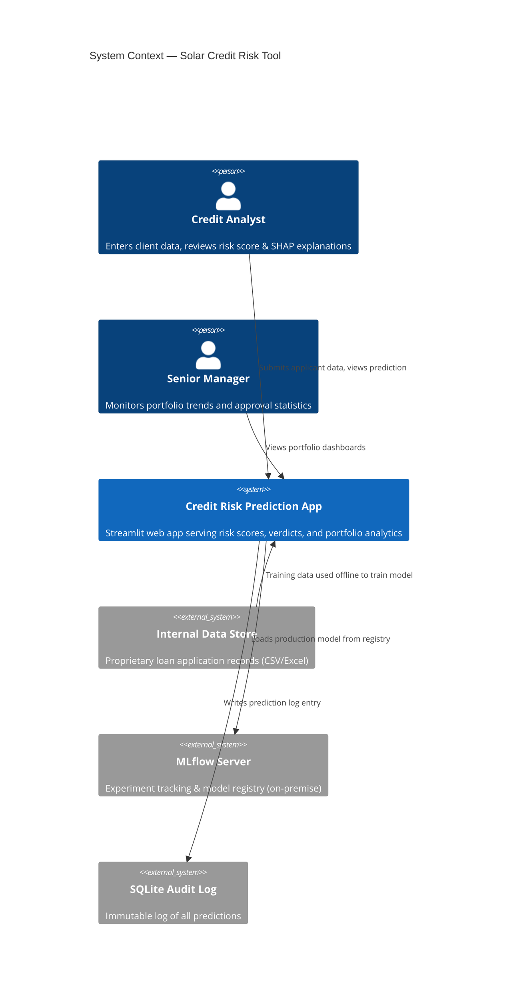
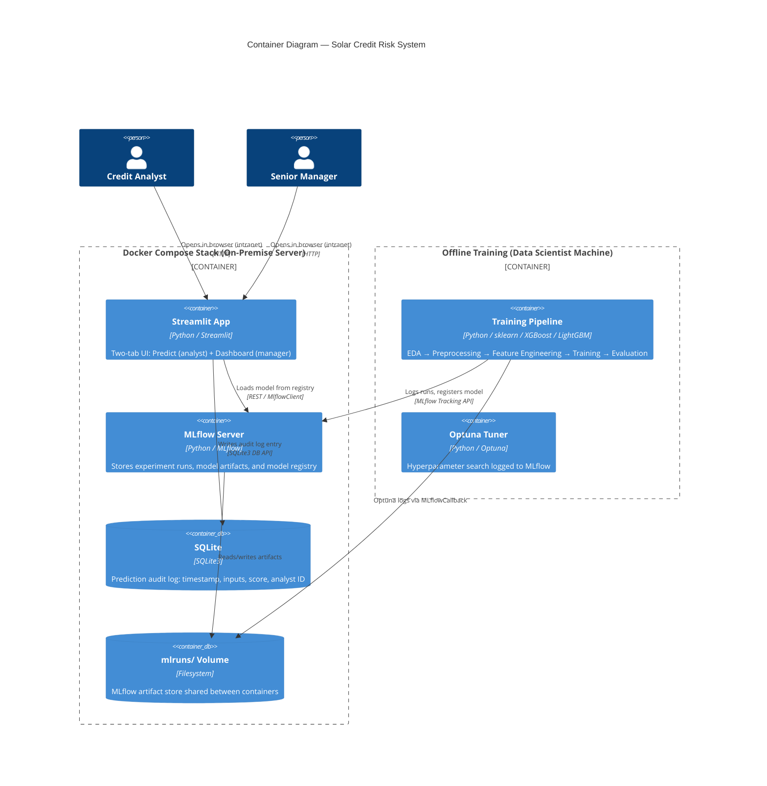
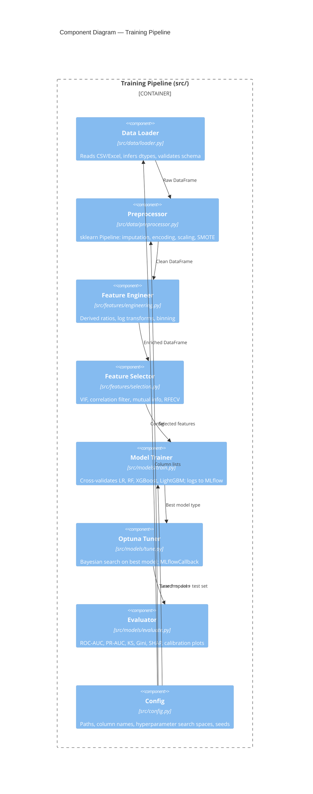
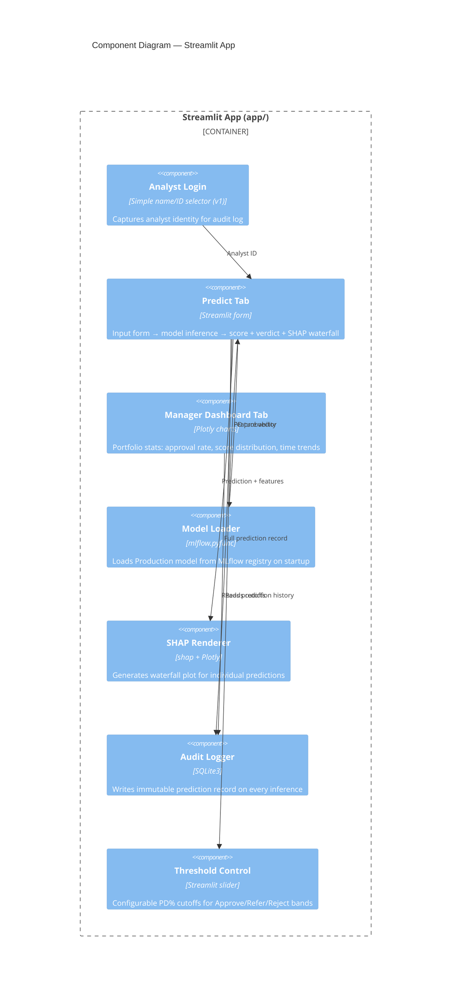
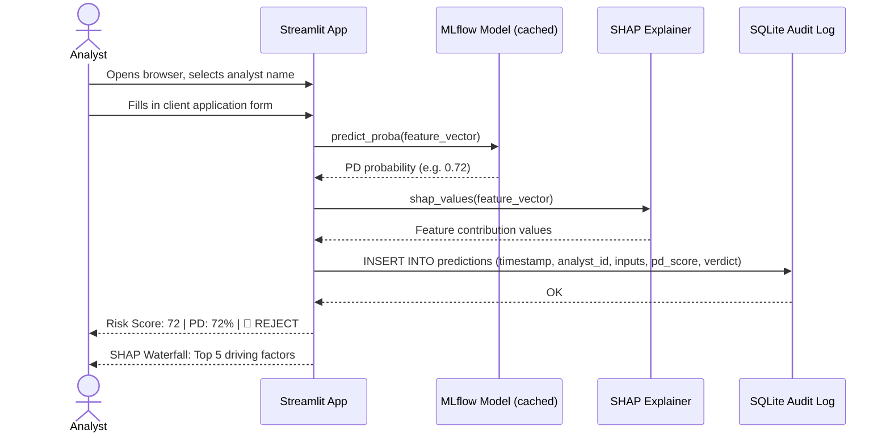
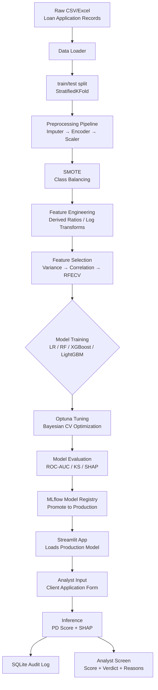
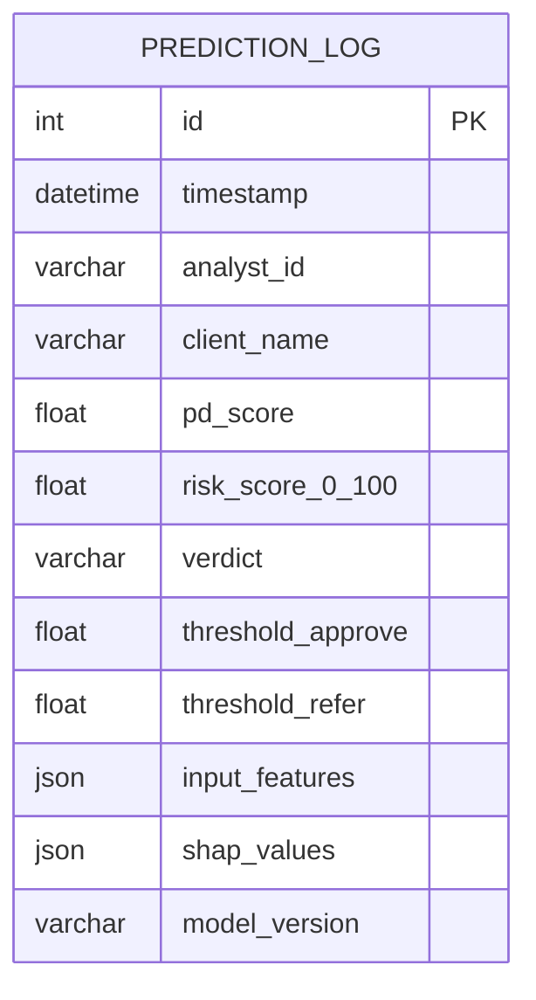

# Solar Industry Credit Risk Prediction System
## Design Document v1.0

**Date:** 2026-04-19
**Status:** Accepted
**Authors:** AI-assisted design via structured brainstorming

---

## 1. Overview

An internal credit risk prediction tool for a solar energy company that installs panels in industrial
clients on its own investment. The system predicts whether a client (industrial company) can repay
the financing over time.

**Core user personas:**
- **Credit Analysts** — enter applicant data, receive risk score + explanations, make decisions
- **Senior Managers** — monitor portfolio health, approval trends, and credit risk exposure

---

## 2. System Context Diagram (C4 Level 1)



---

## 3. Container Diagram (C4 Level 2)



---

## 4. Component Diagram (C4 Level 3) — Training Pipeline



---

## 5. Component Diagram — Streamlit App



---

## 6. Sequence Diagram — Analyst Making a Prediction



---

## 7. Data Flow Diagram



---

## 8. Entity-Relationship Diagram — Audit Log



---

## 9. Architecture Decision Records (ADRs)

---

### ADR-001: Streamlit over FastAPI + React

**Status:** Accepted

**Context:**
Internal tool for ~10 concurrent analysts. Need rapid delivery with rich UI including forms, charts, and SHAP plots.

**Decision:** Use Streamlit

**Rationale:**
- Python-native — same language as ML pipeline, no context switching
- SHAP + Plotly integrate natively
- Two-tab layout satisfies both analyst and manager personas
- No frontend engineer needed

**Trade-offs:**
- Not suitable if > 100 concurrent users are needed
- Limited custom UI flexibility compared to React

**Mitigation:** Migrate to FastAPI + React if user count scales beyond 50 concurrent users.

**Revisit Trigger:** User count > 50 concurrent, or mobile access required.

---

### ADR-002: SQLite for Prediction Audit Log

**Status:** Accepted

**Context:**
Every prediction must be logged with full inputs + score + analyst ID. Dataset is small (< 50K predictions/year). No existing DB infrastructure.

**Decision:** SQLite3 file on the same server as the app

**Rationale:**
- Zero configuration, no DB server admin required
- Supports < 10 concurrent writes (sufficient for this team size)
- File-based backup is trivial
- Audit queries are infrequent (manager dashboard)

**Trade-offs:**
- Not suitable for multi-server deployments
- No built-in access control at DB level

**Mitigation:** Migrate to PostgreSQL if team scales or multi-region deployment needed.

**Revisit Trigger:** > 3 concurrent write transactions per second sustained, or multi-server deployment.

---

### ADR-003: XGBoost / LightGBM as Primary Model Family

**Status:** Accepted

**Context:**
< 50K tabular records, binary classification, class imbalance expected, explainability required.

**Decision:** Train LR, RF, XGBoost, LightGBM — promote best on ROC-AUC + KS statistic

**Rationale:**
- Gradient boosted trees consistently win on tabular data at this scale
- Native SHAP support in both XGBoost and LightGBM (TreeExplainer — fast)
- Handles missing values well (important since columns are TBD)
- sklearn API compatibility with MLflow autolog

**Trade-offs:**
- Logistic Regression (simpler, more interpretable) trained as baseline/fallback
- Neural networks excluded (overkill for < 50K records, no image/text data)

**Revisit Trigger:** Dataset grows > 500K records, or time-series/sequential patterns identified.

---

### ADR-004: MLflow for Experiment Tracking and Model Registry

**Status:** Accepted

**Context:**
One-time training initially, manual retraining when needed. Need reproducibility and model versioning.

**Decision:** MLflow with local filesystem artifact store, promoted via Model Registry stages

**Rationale:**
- De facto standard for Python ML tracking
- Model Registry provides Staging → Production promotion workflow
- Streamlit loads model via `mlflow.pyfunc.load_model("models:/CreditRiskModel/Production")`
- Free, open-source, Docker-deployable

**Trade-offs:**
- No automated drift detection (acceptable for v1 manual retraining)
- S3/GCS remote can be added later without code changes

**Revisit Trigger:** Automated retraining needed, or multi-team model sharing required.

---

### ADR-005: Docker Compose for Deployment

**Status:** Accepted

**Context:**
Hybrid deployment — MLflow on-premise, Streamlit accessible on internal browser network.

**Decision:** Docker Compose with two services: `mlflow` + `streamlit_app`, sharing a `mlruns/` volume

**Rationale:**
- Single `docker-compose up` command for full stack
- Shared volume ensures model artifacts are accessible to both containers
- Port 5000 (MLflow UI) and 8501 (Streamlit) exposed on intranet

**Trade-offs:**
- No HA / load balancing (single server)
- Manual container restart on failure

**Mitigation:** Add `restart: always` policy in docker-compose. Acceptable for internal tool.

**Revisit Trigger:** Uptime SLA required, or traffic exceeds single-server capacity.

---

## 10. Non-Functional Requirements

| Requirement | Specification | Rationale |
|---|---|---|
| **Prediction latency** | < 2 seconds end-to-end | Acceptable for manual underwriting workflow |
| **Availability** | Business hours only (9am–6pm) | Internal tool, no 24×7 SLA needed |
| **Data privacy** | All data stays on-premise | Proprietary client financial records |
| **Auditability** | 100% prediction logging | Regulatory / compliance requirement |
| **Concurrency** | Up to 10 simultaneous analysts | Internal team size |
| **Explainability** | SHAP waterfall per prediction | Regulatory justification + analyst trust |
| **Reproducibility** | All experiments versioned in MLflow | Model governance and retraining baseline |

---

## 11. Project Folder Structure

```
credit_risk_prediction/
├── data/
│   ├── raw/                        # Original dataset (gitignored)
│   └── processed/                  # Transformed datasets
├── docs/
│   └── architecture/
│       └── design_document.md      # This file
├── src/
│   ├── config.py                   # Central config (paths, columns, seeds)
│   ├── data/
│   │   ├── loader.py               # Data loading & schema validation
│   │   └── preprocessor.py         # sklearn Pipeline builder + SMOTE
│   ├── features/
│   │   ├── engineering.py          # Derived features
│   │   └── selection.py            # Feature selection pipeline
│   ├── models/
│   │   ├── train.py                # Training + MLflow logging
│   │   ├── tune.py                 # Optuna study
│   │   └── evaluate.py             # Metrics + SHAP plots
│   └── pipeline.py                 # End-to-end runner
├── app/
│   └── streamlit_app.py            # Two-tab Streamlit UI
├── tests/
│   ├── test_loader.py
│   ├── test_preprocessor.py
│   ├── test_engineering.py
│   ├── test_selection.py
│   └── test_evaluate.py
├── docker/
│   ├── Dockerfile.app
│   └── Dockerfile.mlflow
├── docker-compose.yml
├── pyproject.toml
└── README.md
```

---

## 12. Decision Log Summary

| Decision | Chosen | Key Reason |
|---|---|---|
| UI Framework | Streamlit | Python-native, SHAP-compatible, rapid delivery |
| Audit Store | SQLite | Zero-config, on-premise, sufficient for team scale |
| Model Family | XGBoost / LightGBM | Best tabular performance + native SHAP TreeExplainer |
| ML Tracking | MLflow | Industry standard, Docker-deployable, free |
| Deployment | Docker Compose | Single-command full stack, shared volume for mlruns |
| Auth (v1) | Analyst name selector | Captures ID without SSO complexity; upgrade later |
| Retraining | Manual / on-demand | One-time training for now; automate when data grows |
