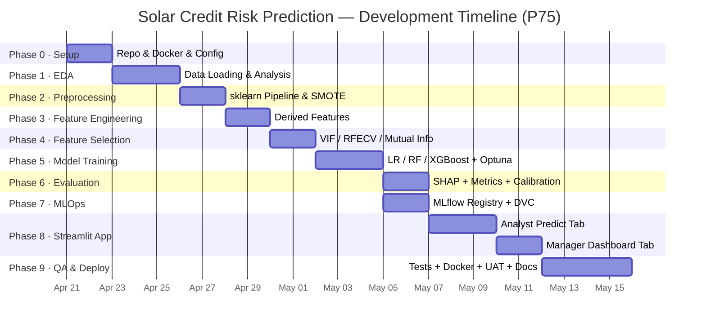

# Solar Credit Risk Prediction — Project Estimation & Timeline

**Date:** 2026-04-19
**Method:** Progressive Estimation (PERT · P50 / P75 / P90 confidence bands)
**Team Mode:** Hybrid — 1 Data Scientist + AI coding agent (~60% AI-assisted implementation)
**Working hours:** 6 productive hours/day (accounts for meetings, reviews, context-switching)

---

## 1. Estimation Methodology

### PERT Formula

For each task, three-point estimates are collected:

| Symbol | Meaning |
|--------|---------|
| **O** | Optimistic — everything goes right, no blockers |
| **M** | Most Likely — realistic with normal friction |
| **P** | Pessimistic — integrations break, data issues, rework |

```
PERT Expected (E)  = (O + 4M + P) / 6
PERT Std Dev  (σ)  = (P − O) / 6
PERT Variance (V)  = σ²
```

### Confidence Bands

| Band | Formula | Use For |
|------|---------|---------|
| **P50** | E | Internal planning target |
| **P75** | E + 0.674 × σ | Team commitment to management |
| **P90** | E + 1.282 × σ | External stakeholder commitment |

### AI Multiplier Applied

For hybrid mode with ~60% AI assistance, implementation tasks carry a **0.45× velocity multiplier** on human-only estimates (based on Enreign research benchmarks for code generation + review cycles). Research, design, and testing tasks carry **0.75×** (AI assists but human judgment dominates).

---

## 2. Task Estimates by Phase

### Phase 0 — Project Setup & Infrastructure

| Task | O (h) | M (h) | P (h) | E (h) | σ | P75 (h) | P90 (h) | T-Shirt |
|------|-------|-------|-------|-------|---|---------|---------|---------|
| Repo scaffold + uv/venv setup | 0.5 | 1 | 2 | 1.1 | 0.3 | 1.3 | 1.5 | XS |
| config.py + pyproject.toml | 0.5 | 1 | 1.5 | 1.0 | 0.2 | 1.1 | 1.3 | XS |
| Docker Compose (MLflow + App) | 1 | 2 | 4 | 2.2 | 0.5 | 2.5 | 2.8 | S |
| SQLite schema + audit logger | 0.5 | 1 | 2 | 1.1 | 0.3 | 1.3 | 1.5 | XS |
| **Phase 0 Total** | | | | **5.4** | | **6.2** | **7.1** | |

**Phase 0 calendar:** 1 day (P50) → 1.5 days (P90)

---

### Phase 1 — EDA (Exploratory Data Analysis)

| Task | O (h) | M (h) | P (h) | E (h) | σ | P75 (h) | P90 (h) | T-Shirt |
|------|-------|-------|-------|-------|---|---------|---------|---------|
| Data loading + schema validation | 0.5 | 1 | 3 | 1.3 | 0.4 | 1.6 | 1.8 | XS |
| Univariate distributions + histograms | 1 | 2 | 4 | 2.2 | 0.5 | 2.5 | 2.8 | S |
| Bivariate / target correlation analysis | 1 | 2 | 4 | 2.2 | 0.5 | 2.5 | 2.8 | S |
| Missing value heatmap + strategy doc | 0.5 | 1 | 2 | 1.1 | 0.3 | 1.3 | 1.5 | XS |
| Outlier detection (IQR / z-score) | 0.5 | 1 | 2 | 1.1 | 0.3 | 1.3 | 1.5 | XS |
| Class imbalance analysis + report | 0.5 | 1 | 2 | 1.1 | 0.3 | 1.3 | 1.5 | XS |
| ydata-profiling HTML report | 0.5 | 1 | 2 | 1.1 | 0.3 | 1.3 | 1.5 | XS |
| **Phase 1 Total** | | | | **10.1** | | **11.8** | **13.4** | |

> ⚠️ **Risk note:** Column names and types not yet confirmed (OQ1). If significant data quality issues are found, add +4h buffer.

**Phase 1 calendar:** 1.5 days (P50) → 2.5 days (P90)

---

### Phase 2 — Preprocessing Pipeline

| Task | O (h) | M (h) | P (h) | E (h) | σ | P75 (h) | P90 (h) | T-Shirt |
|------|-------|-------|-------|-------|---|---------|---------|---------|
| Imputation strategy per column | 1 | 2 | 4 | 2.2 | 0.5 | 2.5 | 2.8 | S |
| Categorical encoding (OHE / Ordinal) | 0.5 | 1 | 2 | 1.1 | 0.3 | 1.3 | 1.5 | XS |
| Feature scaling (Standard / Robust) | 0.5 | 1 | 1.5 | 1.0 | 0.2 | 1.1 | 1.3 | XS |
| Stratified train/test split | 0.3 | 0.5 | 1 | 0.6 | 0.1 | 0.7 | 0.7 | XS |
| SMOTE integration + class weight check | 0.5 | 1 | 2 | 1.1 | 0.3 | 1.3 | 1.5 | XS |
| sklearn Pipeline assembly + tests | 1 | 2 | 4 | 2.2 | 0.5 | 2.5 | 2.8 | S |
| **Phase 2 Total** | | | | **8.2** | | **9.4** | **10.6** | |

**Phase 2 calendar:** 1.5 days (P50) → 2 days (P90)

---

### Phase 3 — Feature Engineering

| Task | O (h) | M (h) | P (h) | E (h) | σ | P75 (h) | P90 (h) | T-Shirt |
|------|-------|-------|-------|-------|---|---------|---------|---------|
| Derived financial ratios | 1 | 2 | 4 | 2.2 | 0.5 | 2.5 | 2.8 | S |
| Log-transform skewed features | 0.5 | 1 | 2 | 1.1 | 0.3 | 1.3 | 1.5 | XS |
| Date/tenure-based features | 0.5 | 1 | 3 | 1.3 | 0.4 | 1.6 | 1.8 | XS |
| Binning / polynomial features | 0.5 | 1 | 2 | 1.1 | 0.3 | 1.3 | 1.5 | XS |
| **Phase 3 Total** | | | | **5.7** | | **6.7** | **7.6** | |

**Phase 3 calendar:** 1 day (P50) → 1.5 days (P90)

---

### Phase 4 — Feature Selection

| Task | O (h) | M (h) | P (h) | E (h) | σ | P75 (h) | P90 (h) | T-Shirt |
|------|-------|-------|-------|-------|---|---------|---------|---------|
| Variance threshold filter | 0.3 | 0.5 | 1 | 0.6 | 0.1 | 0.7 | 0.7 | XS |
| Correlation-based removal (VIF) | 0.5 | 1 | 2 | 1.1 | 0.3 | 1.3 | 1.5 | XS |
| SelectKBest (chi2 / mutual_info) | 0.5 | 1 | 2 | 1.1 | 0.3 | 1.3 | 1.5 | XS |
| Permutation importance / RFECV | 1 | 2 | 4 | 2.2 | 0.5 | 2.5 | 2.8 | S |
| Final feature list document | 0.3 | 0.5 | 1 | 0.6 | 0.1 | 0.7 | 0.7 | XS |
| **Phase 4 Total** | | | | **5.6** | | **6.5** | **7.2** | |

**Phase 4 calendar:** 1 day (P50) → 1.5 days (P90)

---

### Phase 5 — Model Training & Tuning

| Task | O (h) | M (h) | P (h) | E (h) | σ | P75 (h) | P90 (h) | T-Shirt |
|------|-------|-------|-------|-------|---|---------|---------|---------|
| Baseline: Logistic Regression + MLflow | 0.5 | 1 | 2 | 1.1 | 0.3 | 1.3 | 1.5 | XS |
| Random Forest + cross-validation | 0.5 | 1 | 2 | 1.1 | 0.3 | 1.3 | 1.5 | XS |
| XGBoost training + MLflow logging | 1 | 2 | 3 | 2.0 | 0.3 | 2.2 | 2.4 | S |
| LightGBM training + MLflow logging | 0.5 | 1 | 2 | 1.1 | 0.3 | 1.3 | 1.5 | XS |
| Optuna hyperparameter study | 1 | 3 | 6 | 3.2 | 0.8 | 3.7 | 4.2 | M |
| MLflow Model Registry promotion | 0.5 | 1 | 2 | 1.1 | 0.3 | 1.3 | 1.5 | XS |
| **Phase 5 Total** | | | | **9.6** | | **11.1** | **12.6** | |

> ⚠️ **Risk note:** Optuna optimization compute time depends on data size and hardware. Shown estimates are wall-clock *work* hours, not run time.

**Phase 5 calendar:** 1.5 days (P50) → 2.5 days (P90)

---

### Phase 6 — Model Evaluation & Explainability

| Task | O (h) | M (h) | P (h) | E (h) | σ | P75 (h) | P90 (h) | T-Shirt |
|------|-------|-------|-------|-------|---|---------|---------|---------|
| Confusion matrix + ROC/PR-AUC | 0.5 | 1 | 2 | 1.1 | 0.3 | 1.3 | 1.5 | XS |
| KS Statistic + Gini + threshold analysis | 0.5 | 1 | 2 | 1.1 | 0.3 | 1.3 | 1.5 | XS |
| Global SHAP (beeswarm / bar plots) | 1 | 2 | 3 | 2.0 | 0.3 | 2.2 | 2.4 | S |
| Local SHAP (waterfall per instance) | 0.5 | 1 | 2 | 1.1 | 0.3 | 1.3 | 1.5 | XS |
| Calibration curve | 0.5 | 1 | 2 | 1.1 | 0.3 | 1.3 | 1.5 | XS |
| Threshold calibration (Approve/Refer/Reject) | 1 | 2 | 4 | 2.2 | 0.5 | 2.5 | 2.8 | S |
| Evaluation report (HTML / Markdown) | 0.5 | 1 | 2 | 1.1 | 0.3 | 1.3 | 1.5 | XS |
| **Phase 6 Total** | | | | **9.7** | | **11.2** | **12.7** | |

**Phase 6 calendar:** 1.5 days (P50) → 2.5 days (P90)

---

### Phase 7 — MLOps Infrastructure

| Task | O (h) | M (h) | P (h) | E (h) | σ | P75 (h) | P90 (h) | T-Shirt |
|------|-------|-------|-------|-------|---|---------|---------|---------|
| MLflow tracking server config | 0.5 | 1 | 2 | 1.1 | 0.3 | 1.3 | 1.5 | XS |
| Model Registry stages + aliases | 0.5 | 1 | 2 | 1.1 | 0.3 | 1.3 | 1.5 | XS |
| DVC data versioning setup | 1 | 2 | 4 | 2.2 | 0.5 | 2.5 | 2.8 | S |
| Pipeline runner script (retraining) | 1 | 2 | 3 | 2.0 | 0.3 | 2.2 | 2.4 | S |
| **Phase 7 Total** | | | | **6.4** | | **7.3** | **8.2** | |

**Phase 7 calendar:** 1 day (P50) → 1.5 days (P90)

---

### Phase 8 — Streamlit App

| Task | O (h) | M (h) | P (h) | E (h) | σ | P75 (h) | P90 (h) | T-Shirt |
|------|-------|-------|-------|-------|---|---------|---------|---------|
| App shell + analyst login selector | 0.5 | 1 | 2 | 1.1 | 0.3 | 1.3 | 1.5 | XS |
| Input form + field validation | 1 | 2 | 4 | 2.2 | 0.5 | 2.5 | 2.8 | S |
| Model loading from MLflow registry | 0.5 | 1 | 2 | 1.1 | 0.3 | 1.3 | 1.5 | XS |
| Risk score + verdict + color display | 1 | 2 | 3 | 2.0 | 0.3 | 2.2 | 2.4 | S |
| SHAP waterfall plot (Plotly) | 1 | 2 | 4 | 2.2 | 0.5 | 2.5 | 2.8 | S |
| Configurable threshold controls | 0.5 | 1 | 2 | 1.1 | 0.3 | 1.3 | 1.5 | XS |
| Batch CSV upload + scoring | 1 | 2 | 4 | 2.2 | 0.5 | 2.5 | 2.8 | S |
| SQLite audit log write + read | 0.5 | 1 | 2 | 1.1 | 0.3 | 1.3 | 1.5 | XS |
| Manager dashboard (Plotly charts) | 2 | 4 | 8 | 4.3 | 1.0 | 4.98 | 5.58 | M |
| **Phase 8 Total** | | | | **17.3** | | **19.9** | **22.3** | |

> ⚠️ **Risk note (OQ3):** Threshold definitions (Approve/Refer/Reject cutoffs) need business sign-off before app can be finalized. Block +2h if delayed.

**Phase 8 calendar:** 3 days (P50) → 4 days (P90)

---

### Phase 9 — Testing, Deployment & Documentation

| Task | O (h) | M (h) | P (h) | E (h) | σ | P75 (h) | P90 (h) | T-Shirt |
|------|-------|-------|-------|-------|---|---------|---------|---------|
| Unit tests (loader, preprocessor, engineer) | 1 | 2 | 4 | 2.2 | 0.5 | 2.5 | 2.8 | S |
| Integration tests (pipeline end-to-end) | 1 | 2 | 4 | 2.2 | 0.5 | 2.5 | 2.8 | S |
| Dockerfile.app + Dockerfile.mlflow | 0.5 | 1 | 3 | 1.3 | 0.4 | 1.6 | 1.8 | XS |
| docker-compose.yml + networking | 0.5 | 1 | 3 | 1.3 | 0.4 | 1.6 | 1.8 | XS |
| UAT with analysts (smoke test) | 1 | 2 | 4 | 2.2 | 0.5 | 2.5 | 2.8 | S |
| Bug fixes from UAT | 1 | 3 | 6 | 3.2 | 0.8 | 3.7 | 4.2 | M |
| README.md + deployment guide | 1 | 2 | 3 | 2.0 | 0.3 | 2.2 | 2.4 | S |
| **Phase 9 Total** | | | | **14.4** | | **16.6** | **18.6** | |

**Phase 9 calendar:** 2.5 days (P50) → 3.5 days (P90)

---

## 3. Project Summary

| Phase | Description | E (h) | P75 (h) | P90 (h) | Calendar Days (P50) | Calendar Days (P90) |
|-------|-------------|-------|---------|---------|---------------------|---------------------|
| 0 | Setup & Infrastructure | 5.4 | 6.2 | 7.1 | 1 | 1.5 |
| 1 | EDA | 10.1 | 11.8 | 13.4 | 1.5 | 2.5 |
| 2 | Preprocessing | 8.2 | 9.4 | 10.6 | 1.5 | 2 |
| 3 | Feature Engineering | 5.7 | 6.7 | 7.6 | 1 | 1.5 |
| 4 | Feature Selection | 5.6 | 6.5 | 7.2 | 1 | 1.5 |
| 5 | Model Training & Tuning | 9.6 | 11.1 | 12.6 | 1.5 | 2.5 |
| 6 | Evaluation & Explainability | 9.7 | 11.2 | 12.7 | 1.5 | 2.5 |
| 7 | MLOps Infrastructure | 6.4 | 7.3 | 8.2 | 1 | 1.5 |
| 8 | Streamlit App | 17.3 | 19.9 | 22.3 | 3 | 4 |
| 9 | Testing & Deployment | 14.4 | 16.6 | 18.6 | 2.5 | 3.5 |
| **TOTAL** | | **92.4 h** | **106.7 h** | **120.3 h** | **15.5 days** | **23 days** |

---

## 4. Confidence Band Summary

```
P50 (50% confidence):  ~92 hours  = ~15.5 working days ≈ 3 weeks
P75 (75% confidence): ~107 hours  = ~18   working days ≈ 3.5 weeks
P90 (90% confidence): ~120 hours  = ~20   working days ≈ 4 weeks
```

> **Recommended commitment: P75 = 3.5 weeks** (use P90 = 4 weeks for external stakeholders)

---

## 5. Gantt Chart (Calendar View — P75 basis)



**Estimated delivery: ~ 2026-05-15 (P75) | 2026-05-19 (P90)**

---

## 6. Critical Path

```
Setup → EDA → Preprocessing → Feature Engineering → Feature Selection
      → Model Training → Evaluation → MLflow Registry
              → Streamlit App (Predict Tab → Dashboard)
                      → Testing → Docker Deploy → UAT → README
```

**Longest dependency chain:** 15 steps, no phases can run fully in parallel (data flows sequentially through ML pipeline).

**Partial parallelism:** Phase 7 (MLOps infra) can overlap with late Phase 6 (Evaluation) after the model is registered.

---

## 7. Risk Register

| Risk | Probability | Impact | Buffer Added | Mitigation |
|------|-------------|--------|-------------|------------|
| Column names / schema unknown (OQ1) | High | High | +4h in Phase 1 | Early data dictionary meeting with team |
| Default definition unclear (OQ2) | Medium | High | +2h in Phase 5 | Confirm before starting training |
| Business threshold not set (OQ3) | Medium | Medium | +2h in Phase 8 | Use default 30%/60% as placeholder |
| UAT reveals major UX rework | Medium | Medium | +3h in Phase 9 | Analyst demo at Phase 8 mid-point |
| Severe class imbalance (>20:1) | Medium | Medium | Included in P-P | SMOTE + cost-sensitive training pre-planned |
| IT network blocks Docker ports | Low | High | — | Validate intranet access in Phase 0 |

---

## 8. Assumptions

| # | Assumption |
|---|---|
| A1 | 1 data scientist working on this project full-time |
| A2 | AI agent (~60% assist) used throughout implementation |
| A3 | Dataset is available and accessible from Day 1 |
| A4 | 6 productive hours per working day (6-day week = 36h) |
| A5 | Analysts are available for UAT within 1 day of request |
| A6 | No SSO / LDAP integration required in v1 |
| A7 | Infrastructure (on-premise server) is provisioned before Phase 9 |

---

## 9. Scope Exclusions (Out of Scope for v1)

| Excluded Feature | Rationale | When to Add |
|---|---|---|
| Automated retraining pipeline | Manual retraining sufficient | v2 — if data grows monthly |
| Role-based access control (RBAC) | Small internal team | v2 — if headcount grows |
| REST API / mobile access | Not required by analysts | v2 — if mobile use case emerges |
| Real-time data integration | Batch upload is sufficient | v2 — if CRM integration needed |
| Model drift monitoring (Evidently) | Infrequent retraining | v2 — after 6 months in production |

---

## 10. Calibration Notes

> Feed actuals back into this document after each phase to improve future estimates.

| Phase | Estimated (P75) | Actual | Variance | Note |
|-------|----------------|--------|----------|------|
| 0     | 6.2h | — | — | |
| 1     | 11.8h | — | — | Update after data dictionary received |
| ...   | ... | — | — | |
