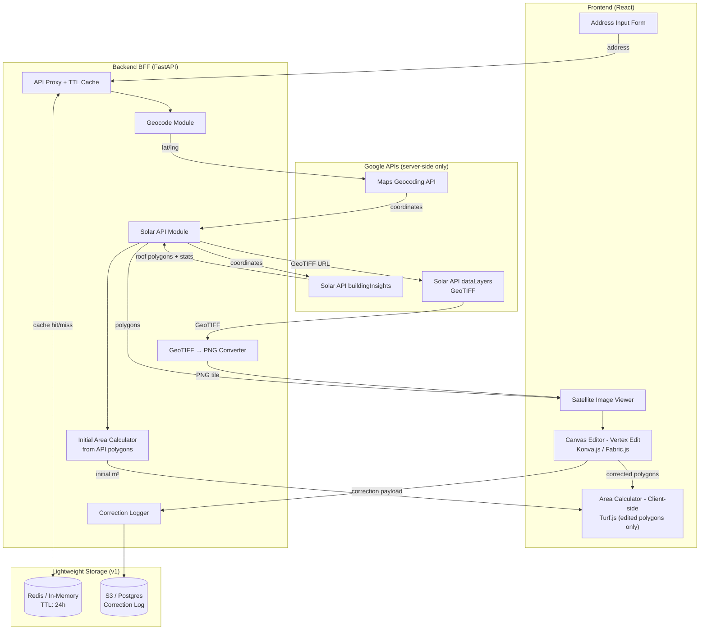
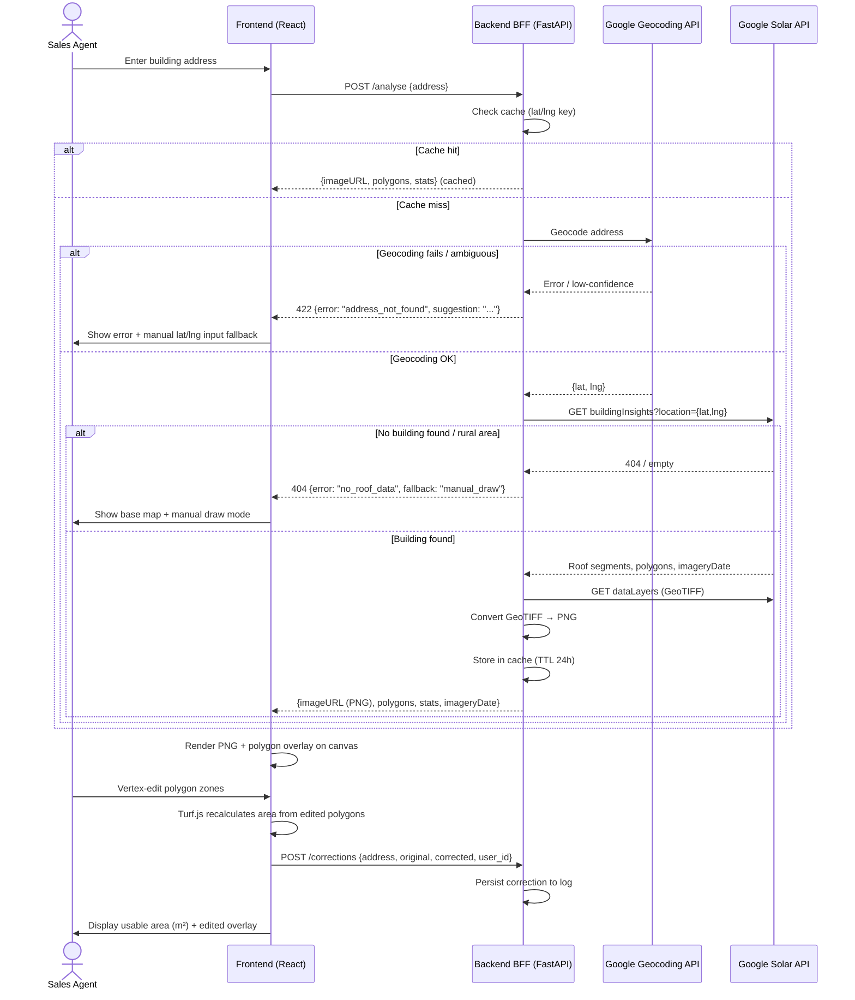
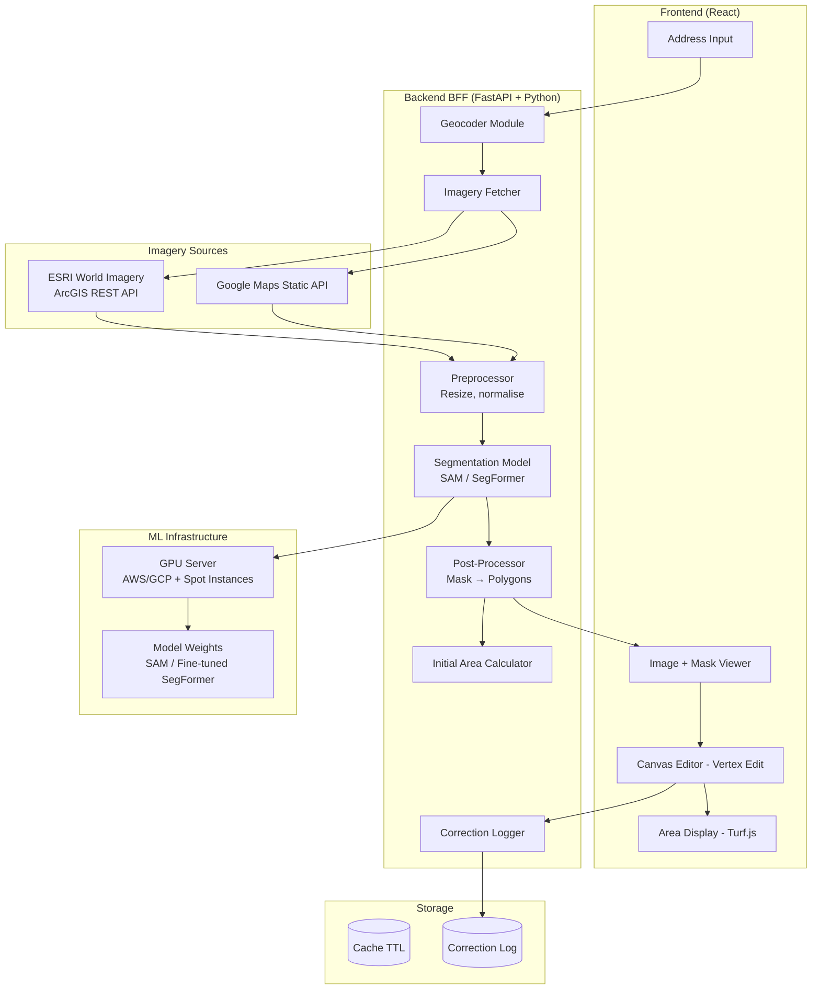
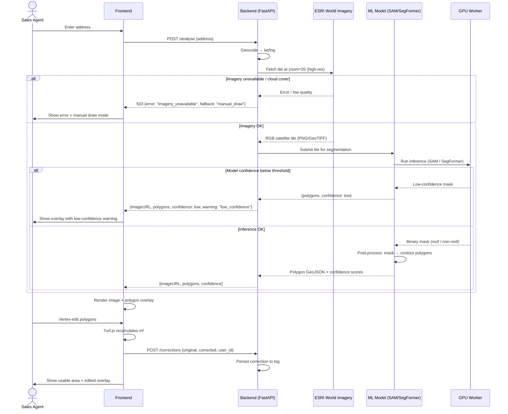
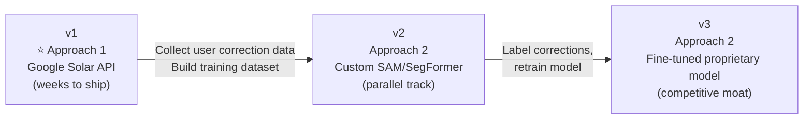
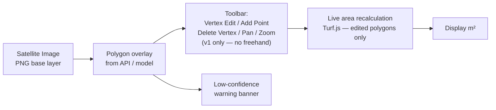

# Roof Segmentation System — Design Document
> **Purpose:** Internal tool for solar installers/sales agents to assess usable roof area from satellite imagery.
> **Status:** Brainstorming / Pre-implementation
> **Date:** 2026-04-18
> **Last Review:** 2026-04-18 (Architect Review — 8 findings applied)

---

## Understanding Summary

| Dimension | Detail |
|---|---|
| **What** | Per-address roof segmentation + usable area (m²) with editable visual overlay |
| **Who** | Solar installers / sales agents (internal) |
| **Imagery** | Satellite (Google Maps / Solar API initially) |
| **Geography** | India v1 → global architecture |
| **Manual correction** | Required in v1 |
| **Non-goals (v1)** | Panel count, energy yield, ROI, mobile app, batch processing |

### Key Assumptions
- `A1` — ~85–90% AI segmentation accuracy is acceptable; manual correction fills gaps
- `A2` — 5–30s per-address processing time is acceptable
- `A3` — Recent imagery (weeks/months old) is sufficient
- `A4` ~~— No persistent storage needed in v1~~ → **REVISED:** Correction data must be persisted even in v1 to enable the v2 training flywheel (see D5, ADR-08)

---

## Approach Comparison

| Criterion | Approach 1 (Google Solar API) | Approach 2 (Custom CV) | Approach 3 (Hosted Inference) |
|---|---|---|---|
| **Time to v1** | ⚡ Fast (weeks) | 🐢 Slow (months) | 🚶 Medium |
| **Accuracy** | ⭐⭐⭐⭐⭐ | ⭐⭐⭐ (improves over time) | ⭐⭐⭐ |
| **Cost model** | Per-call API ($) | Fixed infra (GPU) | Per-call API ($, lower) |
| **Global scale** | ✅ Built-in | ✅ With work | ⚠️ Model coverage varies |
| **ML infra needed** | ❌ None | ✅ Required | ❌ None |
| **Vendor dependency** | Google | None | Roboflow / Azure |
| **Customisability** | Low | High | Medium |

### Recommended Path
> **v1 → Approach 1** (fastest to production quality)
> **v2+ → Migrate segmentation to Approach 2** if API costs grow or custom datasets are available

---

## Approach 1 — Google Solar API + React Canvas Editor ⭐ Recommended

### Overview
Use Google's purpose-built **Solar API** for roof detection and overlay generation. Build a lightweight web frontend with a canvas-based manual correction tool.

> **Security constraint (ADR-06):** All Google API calls must be proxied through the backend. The `API_KEY` must **never** be exposed to the browser. The frontend only communicates with the BFF.

> **GeoTIFF handling (ADR-07):** The `dataLayers` endpoint returns GeoTIFF files (not PNGs). The backend converts these to PNG tiles before serving to the frontend, keeping the frontend dependency-free.

### Architecture (Revised — BFF Pattern)



### Sequence Diagram (with Error Paths)



### Component Breakdown

| Component | Technology | Responsibility |
|---|---|---|
| Address Form | React | User input, validation |
| Map Viewer | React + plain `` | Display PNG satellite tile served by backend |
| Canvas Editor | Konva.js (v1: vertex edit only) | Polygon vertex drag/edit/erase |
| Area Calculator | Turf.js — client-side | Compute m² from *edited* polygons only |
| BFF API | FastAPI (Python) | Proxy, cache, GeoTIFF→PNG, correction log |
| Geocoder Module | Google Maps Geocoding API | Address → lat/lng (server-side) |
| Solar Module | Google Solar API | Roof polygons + imagery (server-side) |
| GeoTIFF Converter | `rio-cogeo` / `rasterio` (Python) | Convert GeoTIFF to PNG on backend |
| Cache | Redis (or in-memory for v1 MVP) | TTL-keyed by rounded lat/lng |
| Correction Log | S3 JSONL or Postgres table | Append-only, feeds v2 training dataset |

### Google Solar API Key Endpoints
```
# All called server-side from BFF — never from browser

GET https://solar.googleapis.com/v1/buildingInsights:findClosest
  ?location.latitude={lat}
  &location.longitude={lng}
  &key={API_KEY}   ← server env var only

→ Returns: roofSegmentStats[], solarPotential, imageryDate

GET https://solar.googleapis.com/v1/dataLayers:get
  ?location.latitude={lat}
  &location.longitude={lng}
  &radiusMeters=50
  &view=IMAGERY_AND_ANNUAL_FLUX
  &key={API_KEY}   ← server env var only

→ Returns: RGB imagery GeoTIFF URLs
→ Backend fetches GeoTIFF and converts to PNG before forwarding
```

### Area Calculation Ownership
| Polygon source | Calculated by | Why |
|---|---|---|
| Initial API polygons | Backend (Python) | Available at response time |
| User-edited polygons | Frontend (Turf.js) | Backend doesn't know final edit state |

### Trade-offs
- ✅ No ML infra, no training data, fast v1
- ✅ Purpose-built for solar — roof pitches, obstructions already considered
- ✅ API key fully secured server-side
- ✅ GeoTIFF complexity hidden from frontend
- ⚠️ ~$0.004–0.02 per lookup; TTL cache reduces repeat cost significantly
- ⚠️ Google controls imagery freshness and API availability

---

## Approach 2 — Custom CV Pipeline (SAM / SegFormer)

### Overview
Own the full ML stack. Fetch satellite tiles from ESRI or Google Static Maps, run segmentation via SAM or a fine-tuned aerial segmentation model, and stream results to the same frontend canvas editor.

### Architecture



### Sequence Diagram (with Error Paths)



### ML Model Options

| Model | Type | Strength | Dataset to fine-tune on |
|---|---|---|---|
| **SAM (Meta)** | Foundation / zero-shot | Works without training | Prompt with roof bounding box |
| **SegFormer-B2** | Transformer segmentation | High accuracy, efficient | SpaceNet, INRIA Aerial |
| **Mask2Former** | Universal segmentation | SOTA on aerial | iSAID, Potsdam |
| **YOLOv8-seg** | Fast instance segmentation | Real-time capable | DOTA, custom rooftop |

### Obstruction Detection (Chimneys, HVAC)
Run a secondary **object detection model** (YOLOv8 or similar) on the cropped roof tile to identify obstructions, then subtract their bounding polygons from usable area.

### Trade-offs
- ✅ Full ownership, no per-call costs at scale
- ✅ Can be tuned for Indian flat-roof typology
- ✅ Proprietary model = competitive moat over time
- ⚠️ Requires GPU infra (AWS `p3.2xlarge` or GCP `n1-standard + T4`)
- ⚠️ Needs labelled aerial data (SpaceNet freely available; custom data = months)
- ⚠️ 3–6 months to production quality

---

## Approach 3 — Hybrid Hosted Inference (Roboflow / Azure)

### Overview
Use a **pre-trained aerial segmentation model hosted on Roboflow** (or Azure Custom Vision) without managing GPU infra, with the same canvas frontend.

### Architecture

```mermaid
graph TB
    subgraph Frontend["Frontend (React)"]
        UI3[Address Input]
        VIEW3[Image Viewer]
        EDIT3[Canvas Editor - Vertex Edit]
        OUT3[Area Display - Turf.js]
    end

    subgraph Backend["Backend BFF"]
        GEO3[Geocoder Module]
        FETCH3[Tile Fetcher]
        INFER[Inference Client]
        CORRLOG3[Correction Logger]
    end

    subgraph ThirdParty["Hosted Inference"]
        RF[Roboflow Inference API\nor Azure Custom Vision]
        MODEL3[Pre-trained Aerial\nSegmentation Model]
    end

    subgraph Storage3["Storage"]
        LOG3[(Correction Log)]
    end

    UI3 --> GEO3
    GEO3 --> FETCH3
    FETCH3 --> INFER
    INFER --> RF
    RF --> MODEL3
    MODEL3 --> RF
    RF -->> INFER
    INFER -->> VIEW3
    VIEW3 --> EDIT3
    EDIT3 --> OUT3
    EDIT3 --> CORRLOG3
    CORRLOG3 --> LOG3
```

### Trade-offs
- ✅ No GPU infra
- ✅ Some ability to upload and fine-tune on custom data (Roboflow)
- ⚠️ Model not purpose-built for roofs — lower baseline accuracy
- ⚠️ Still API-cost dependent
- ⚠️ Coverage and model quality not guaranteed globally

---

## Recommended Migration Path



> User manual corrections from v1 become **training data** for v2 model fine-tuning. This requires the correction log to be in place from day 1 (see ADR-08). The more agents use the tool, the better the model gets.

---

## Decision Log

| # | Decision | Alternatives Considered | Rationale |
|---|---|---|---|
| D1 | Start with Google Solar API | Custom ML, Roboflow | Fastest path to production-quality segmentation without ML infra |
| D2 | Manual correction required in v1 | Auto-only, v2 feature | Users need trust in the output; correction = accuracy guarantee |
| D3 | India first, global architecture | Global from day 1 | Reduces complexity; Solar API covers India and scales globally |
| D4 | Internal tool only (v1) | Public consumer product | Simpler UX, no auth complexity, faster shipping |
| D5 | User corrections → training data | Discard corrections | Creates ML dataset flywheel for free |

### Architecture Decision Records (ADRs)

| ADR | Decision | Rationale |
|---|---|---|
| ADR-01 | BFF pattern — single FastAPI backend proxies all external APIs | Prevents API key leakage; single client-facing contract |
| ADR-02 | Canvas editor: vertex editing only in v1; freehand in v2 | Vertex edit is simpler and sufficient; freehand needs mask-to-polygon conversion |
| ADR-03 | Area from edited polygons: client-side (Turf.js) | Backend doesn't know final edit state without a round-trip POST |
| ADR-04 | Area from initial API polygons: backend (Python) | Available at response time; avoids extra round trip |
| ADR-05 | TTL cache (24h) keyed on rounded lat/lng | Reduces repeat Solar API costs for same address |
| ADR-06 | All Google API calls proxied through backend — never browser-direct | `API_KEY` must never be exposed to the browser |
| ADR-07 | GeoTIFF converted to PNG on backend before serving to frontend | Eliminates `geotiff.js` + `georaster` dependency on frontend |
| ADR-08 | Correction data persisted even in v1 (overrides A4) | Flywheel cannot function without stored corrections; cheap to add now |
| ADR-09 | Error states required for: geocoding fail, no building found, low confidence | Indian address geocoding quality is variable; graceful degradation required |
| ADR-10 | Fallback: manual polygon draw mode when no API data available | Handles new construction, rural areas, informal settlements |

---

## Frontend Canvas Editor — Key Requirements

For all three approaches, the frontend correction layer is identical:



**Recommended library:** `Konva.js` (performance) or `Fabric.js` (ease of use)
**Geodesic area calculation:** `Turf.js` — `turf.area(polygon)` returns m²
**v1 interaction:** Vertex drag only. No freehand mask drawing.
**Error states the UI must handle:**

| Error | UI Behaviour |
|---|---|
| Geocoding failed / ambiguous | Show error message + manual lat/lng input fallback |
| No building found (rural, new build) | Show base map + manual draw mode |
| Low-confidence segmentation | Show overlay with warning banner (yellow) |
| API timeout | Show retry button + manual draw fallback |

---

## Tech Stack Summary (Approach 1 — v1)

| Layer | Technology |
|---|---|
| Frontend | React + Konva.js + Turf.js |
| Backend BFF | FastAPI (Python) |
| GeoTIFF → PNG | `rasterio` / `rio-cogeo` (Python, server-side) |
| Geocoding | Google Maps Geocoding API (server-side) |
| Roof Detection | Google Solar API (server-side) |
| Imagery Tiles | Google Solar API dataLayers → PNG (server-side converted) |
| Cache | Redis (or in-memory dict for MVP) — TTL 24h |
| Correction Log | Postgres table or S3 JSONL append-only |
| Deployment | Docker + AWS/GCP (any cloud) |
| Auth (internal) | Simple API key or SSO (v1) |
| Secret Management | Environment variable / AWS Secrets Manager — never in code |
