# Automated Sales Conversion Workflow — Architecture Design

> **Classification**: Solution Architecture  
> **Design Philosophy**: Event-driven, Durable, Modular, Loosely-Coupled  
> **Core Pattern**: Durable Workflow Orchestration (Entity Actor Model) + Multi-Agent AI Pipeline

---

## Table of Contents

1. [Executive Summary](#1-executive-summary)
2. [Key Design Decisions & Principles](#2-key-design-decisions--principles)
3. [System Context Diagram (C4 Level 1)](#3-system-context-diagram-c4-level-1)
4. [Container Diagram (C4 Level 2)](#4-container-diagram-c4-level-2)
5. [Component Breakdown (C4 Level 3)](#5-component-breakdown-c4-level-3)
6. [Full Workflow Sequence Diagram](#6-full-workflow-sequence-diagram)
7. [Lead Lifecycle State Machine](#7-lead-lifecycle-state-machine)
8. [Voice Agent Architecture](#8-voice-agent-architecture)
9. [Durable Workflow Orchestration Deep Dive](#9-durable-workflow-orchestration-deep-dive)
10. [AI Pipeline — Quotes & Brochure Generation](#10-ai-pipeline--quotes--brochure-generation)
11. [Async Email Loop & Approval Gate](#11-async-email-loop--approval-gate)
12. [Data Model](#12-data-model)
13. [Technology Stack Recommendations](#13-technology-stack-recommendations)
14. [Non-Functional Requirements](#14-non-functional-requirements)
15. [Deployment Architecture](#15-deployment-architecture)

---

## 1. Executive Summary

This architecture automates the end-to-end B2B/B2C sales conversion lifecycle — from the first qualifying voice call with a lead, through AI-powered quote and collateral generation, a human-in-the-loop email approval gate, and an arbitrarily long asynchronous email re-engagement loop.

The defining architectural challenge is **temporal decoupling**: a lead may reply to an email days or weeks later, and the system must faithfully resume exactly where it left off. This is solved with a **Durable Workflow Engine** (Temporal.io) at the core, which persists the full execution state and resumes workflows upon receiving external signals (email replies, approvals).

### Core Capabilities

| Capability | Approach |
|---|---|
| Lead qualification call | Realtime voice AI agent with structured data extraction |
| Quote & brochure generation | Multi-step AI pipeline triggered post-call |
| Human approval of outbound mail | Async signal-wait on Temporal workflow |
| Long-term lead re-engagement | Durable workflow survives for weeks/months |
| Email reply → workflow resumption | Webhook → Temporal signal |
| Modularity | Each stage is an independent service/worker |

---

## 2. Key Design Decisions & Principles

### 2.1 Why Durable Workflow Orchestration (not a plain queue)?

| Concern | Standard Queue | Durable Workflow (Temporal) |
|---|---|---|
| Lead replies after 2 weeks | State lost; must rebuild | State fully preserved automatically |
| Code deploy mid-workflow | Risk of lost messages | Event history replay guarantees recovery |
| Approval gate (pause & wait) | Complex with polling | Native `workflow.wait_condition` / Signal |
| Retry failed AI steps | Manual DLQ handling | Built-in retry with backoff per activity |
| Auditability | Hard to trace | Full event history per lead |

**Decision**: Use **Temporal.io** as the durable orchestration layer. Each lead's entire sales lifecycle is a single long-lived Temporal Workflow, acting as an **Entity Actor**.

### 2.5 Canonical `thread_id` — Domain-Level Correlation ID

Each `WORKFLOW_INSTANCE` carries a stable **`thread_id` (uuid)** that is generated once and never changes — even across Temporal retries or new run IDs. This is propagated as:
- An **OpenTelemetry baggage field** across all service spans
- An **email header** (`X-Thread-ID`) on every outbound message
- A **query parameter** in approval portal URLs
- A **CRM custom field** on every sync

This gives a single, domain-stable handle for end-to-end traceability independent of Temporal internals.

### 2.2 Modularity via Loose Coupling

Each bounded domain is an independent worker/service communicating only through:
- **Temporal Activities** (within the workflow)
- **Async events / webhooks** (for external signals: email replies, approvals)
- **Shared data contracts** (Pydantic schemas / Protobuf)

This means each module — Voice Agent, Quote Engine, Email Service, Approval Service — can be **developed, deployed, and scaled independently**.

### 2.3 Voice Agent Strategy

The voice bot is a **stateful conversational AI agent** that conducts a structured interview. It does **not** directly trigger the workflow — it publishes a `call_completed` event with a structured `LeadProfile` payload. This cleanly separates the real-time (voice) domain from the asynchronous (workflow) domain.

### 2.4 Human-in-the-Loop (HITL) Approval

The system implements a **Temporal Async Callback Pattern**: the workflow pauses awaiting an approval signal. The approver receives a link; clicking approve/reject sends a webhook that translates to a Temporal signal. No polling, no lost state.

---

## 3. System Context Diagram (C4 Level 1)

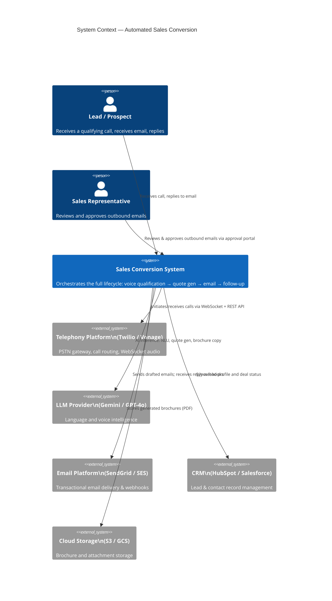

---

## 4. Container Diagram (C4 Level 2)

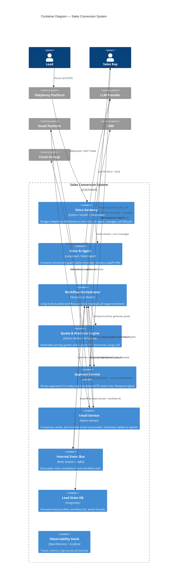

---

## 5. Component Breakdown (C4 Level 3)

### 5.1 Voice AI Agent — Internal Components

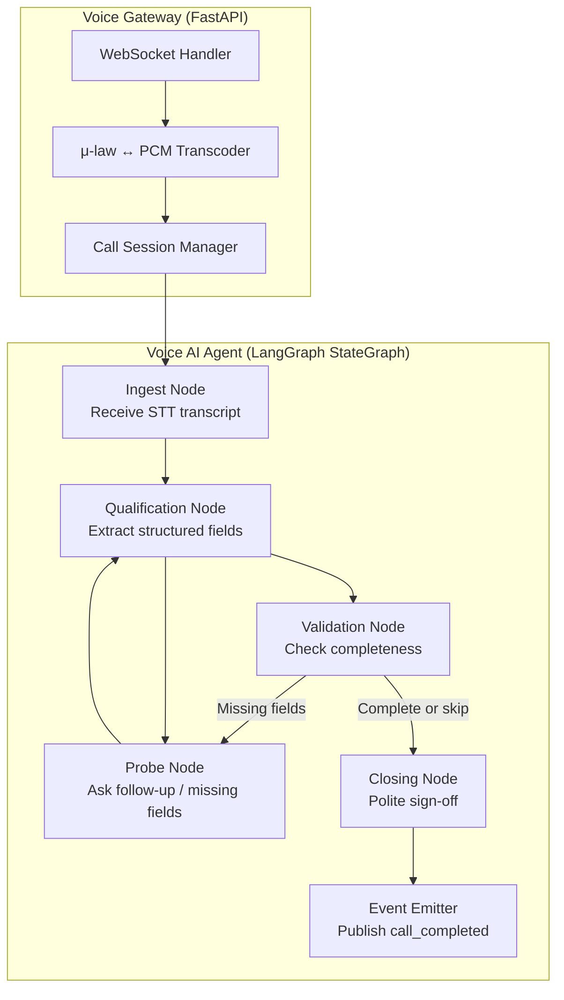

### 5.2 Workflow Orchestrator — Internal Stages

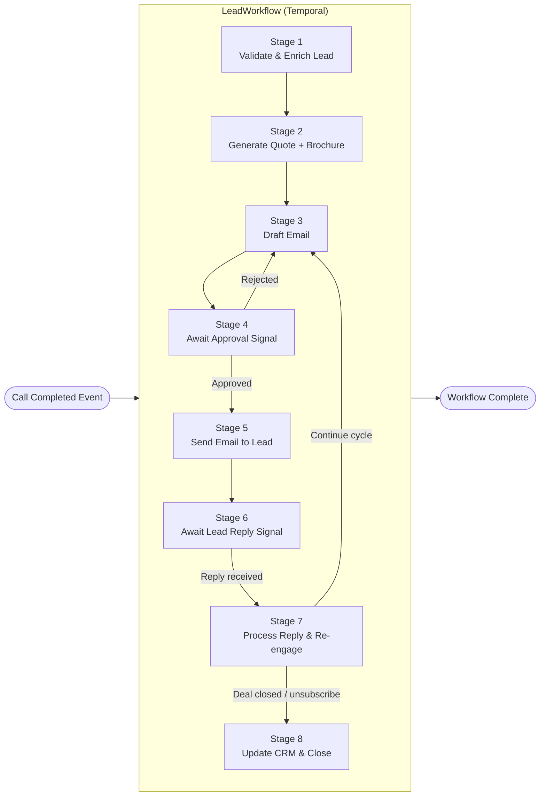

---

## 6. Full Workflow Sequence Diagram

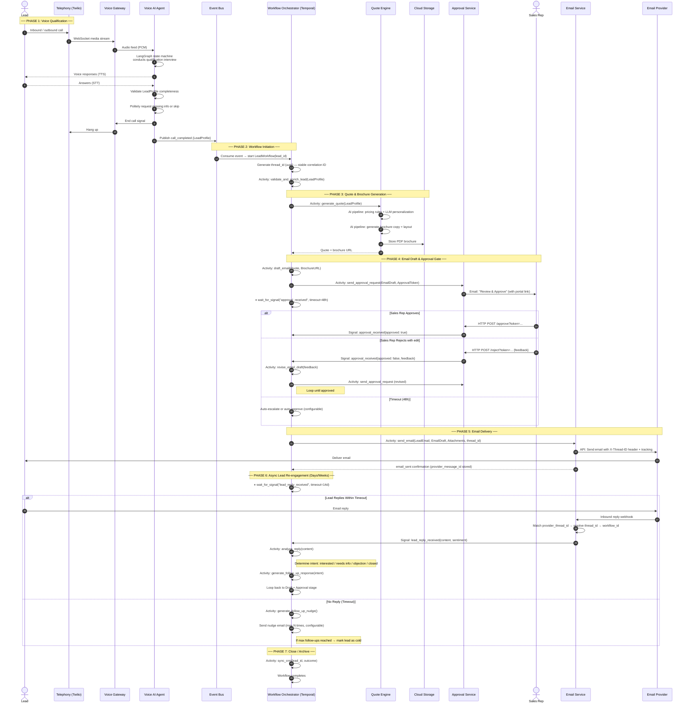

---

## 7. Lead Lifecycle State Machine

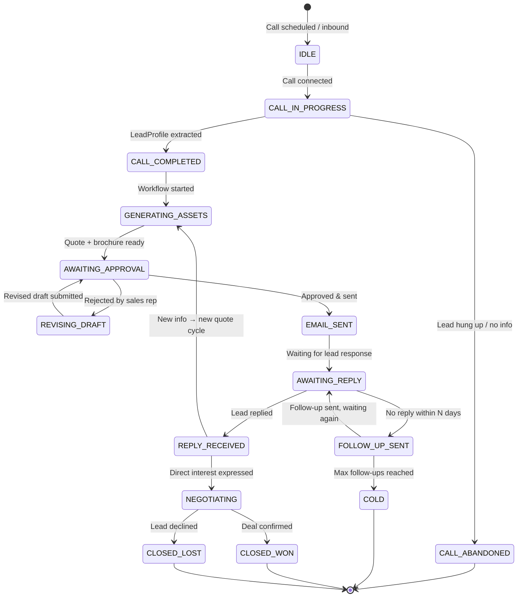

---

## 8. Voice Agent Architecture

### Design Pattern: LangGraph StateGraph with Structured Extraction

The voice agent uses a **stateful graph** (LangGraph `StateGraph`) rather than a simple ReAct loop. This provides:

- **Deterministic state transitions** (no hallucinated routing)
- **Built-in slot filling** (tracks which qualification fields remain missing)
- **Graceful degradation** (politely skips fields the lead refuses to share)

### Conversation State Schema

```python
class CallState(TypedDict):
    transcript: list[Message]           # Full conversation history
    lead_profile: LeadProfile           # Structured extracted data
    missing_fields: list[str]           # Fields not yet collected
    retry_counts: dict[str, int]        # Per-field retry count
    phase: Literal[
        "greeting", "qualifying",
        "probing", "closing", "done"
    ]
```

### Node Graph

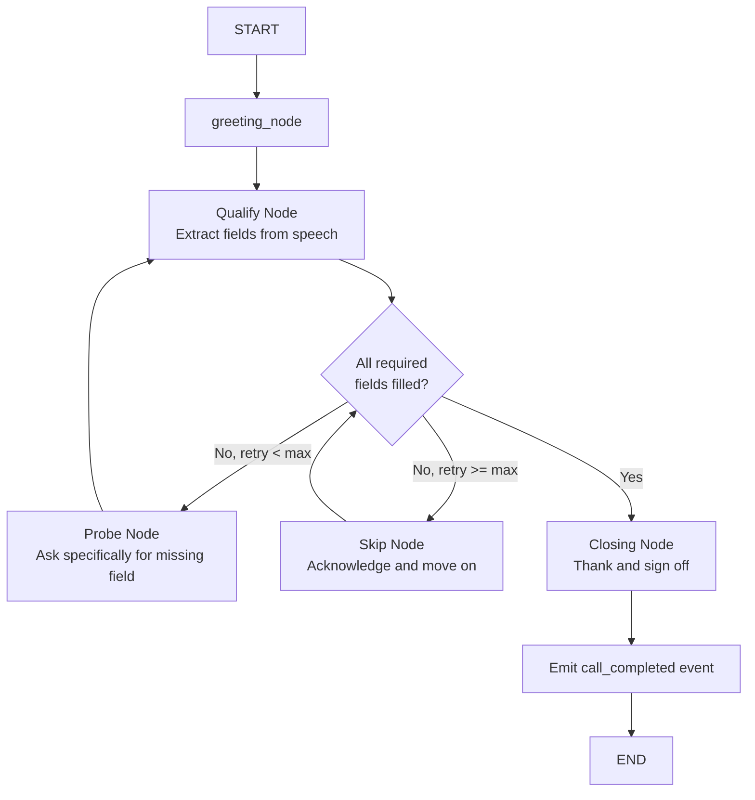

### Voice Stack

| Layer | Technology | Role |
|---|---|---|
| PSTN Gateway | Twilio / Vonage | Call routing, WebSocket media |
| Realtime Audio | Twilio Media Streams | Bidirectional PCM/μ-law stream |
| STT | Deepgram / Gemini Live | Speech-to-text (streaming) |
| LLM | Gemini Flash / GPT-4o-realtime | NLU + response generation |
| TTS | ElevenLabs / Gemini Native Audio | Natural voice synthesis |
| Agent Logic | LangGraph StateGraph | Conversation state machine |
| Session Store | Redis | Active call session state |

> **Note**: The Perry Ellis reference system used Gemini Live API for native audio (unified STT+LLM+TTS in one stream). This is a valid approach for lower latency. The architecture here abstracts this behind the Voice Gateway so either approach is swappable.

---

## 9. Durable Workflow Orchestration Deep Dive

### Why Temporal.io

Temporal provides **durable execution** — the workflow code runs as if it were a normal program, but Temporal's runtime:

1. Checkpoints state after every activity
2. Replays from the checkpoint on worker restart/crash
3. Provides native `await signal` semantics for weeks-long waits
4. Gives complete audit history (event sourcing built-in)

### LeadWorkflow Structure (Python SDK pseudocode)

```python
@workflow.defn
class LeadWorkflow:
    def __init__(self):
        self._approval_signal: Optional[ApprovalResult] = None
        self._reply_signal: Optional[LeadReply] = None

    @workflow.signal
    def approval_received(self, result: ApprovalResult):
        self._approval_signal = result

    @workflow.signal
    def lead_reply_received(self, reply: LeadReply):
        self._reply_signal = reply

    @workflow.run
    async def run(self, lead_profile: LeadProfile) -> str:
        # Stage 1: Enrich
        enriched = await workflow.execute_activity(
            validate_and_enrich_lead, lead_profile,
            start_to_close_timeout=timedelta(minutes=5)
        )

        for cycle in range(MAX_CYCLES):
            # Stage 2: Generate assets
            assets = await workflow.execute_activity(
                generate_quote_and_brochure, enriched,
                start_to_close_timeout=timedelta(minutes=10)
            )

            # Stage 3: Draft + approval loop
            draft = await workflow.execute_activity(draft_email, assets)
            approved = False
            while not approved:
                token = await workflow.execute_activity(
                    send_approval_request, draft
                )
                await workflow.wait_condition(
                    lambda: self._approval_signal is not None,
                    timeout=timedelta(hours=48)
                )
                result = self._approval_signal
                self._approval_signal = None
                if result.approved:
                    approved = True
                else:
                    draft = await workflow.execute_activity(
                        revise_email_draft, draft, result.feedback
                    )

            # Stage 4: Send email + wait for reply
            await workflow.execute_activity(send_email_to_lead, draft, assets)

            nudge_count = 0
            while nudge_count < MAX_NUDGES:
                self._reply_signal = None
                await workflow.wait_condition(
                    lambda: self._reply_signal is not None,
                    timeout=timedelta(days=7)
                )
                if self._reply_signal:
                    reply = self._reply_signal
                    intent = await workflow.execute_activity(
                        analyze_reply_intent, reply
                    )
                    if intent.is_closed:
                        break
                    # Update the enriched profile with new reply info
                    enriched = await workflow.execute_activity(
                        update_profile_from_reply, enriched, reply
                    )
                    break  # Re-enter outer cycle with updated profile
                else:
                    # Timeout — send nudge
                    nudge_count += 1
                    await workflow.execute_activity(
                        send_nudge_email, enriched, nudge_count
                    )

            if intent.is_closed or nudge_count >= MAX_NUDGES:
                break

        # Final stage: CRM sync
        await workflow.execute_activity(sync_crm, enriched, outcome)
        return outcome
```

### Activity Interfaces (Contracts)

```python
# All activities must be idempotent
@activity.defn
async def generate_quote_and_brochure(profile: LeadProfile) -> GeneratedAssets: ...

@activity.defn
async def send_approval_request(draft: EmailDraft) -> ApprovalToken: ...

@activity.defn
async def send_email_to_lead(draft: EmailDraft, assets: GeneratedAssets) -> str: ...

@activity.defn
async def analyze_reply_intent(reply: LeadReply) -> ReplyIntent: ...

@activity.defn
async def sync_crm(profile: LeadProfile, outcome: str) -> None: ...
```

### Signal Flow

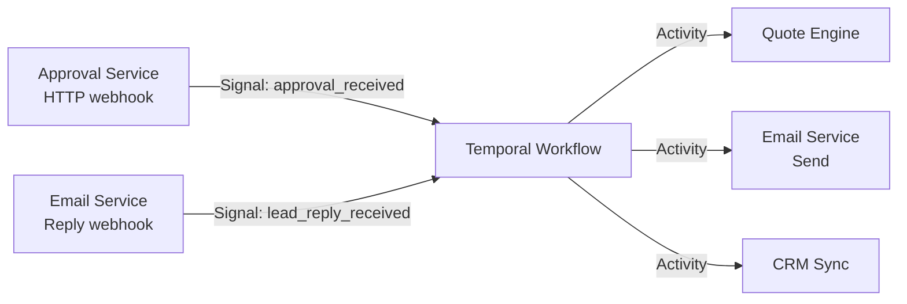

---

## 10. AI Pipeline — Quotes & Brochure Generation

### Pipeline Architecture

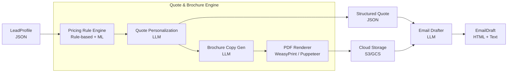

### LLM Prompt Architecture

Each LLM call in the pipeline uses a **dedicated structured prompt** with:
- **System persona**: "You are an expert sales copywriter for [Company]"
- **Lead context injection**: The full `LeadProfile` serialized
- **Output schema**: Pydantic model enforced via JSON mode or tool calling
- **Retry with schema fix**: If output fails validation, automatically retry with correction prompt

---

## 11. Async Email Loop & Approval Gate

### Email Thread Tracking

When an email is sent, the system records:
- `thread_id` (domain uuid, from `WORKFLOW_INSTANCE`) — the stable correlation key
- `provider_thread_id` (provider-specific, e.g. SendGrid InReplyTo chain) → maps to `thread_id`
- `provider_message_id` → for idempotent replay detection

The Email Service maintains an `EMAIL_THREAD` table for this mapping. On inbound reply, the lookup path is:
```
provider_thread_id → EMAIL_THREAD → thread_id → WORKFLOW_INSTANCE → temporal_workflow_id
```

### Reply Processing

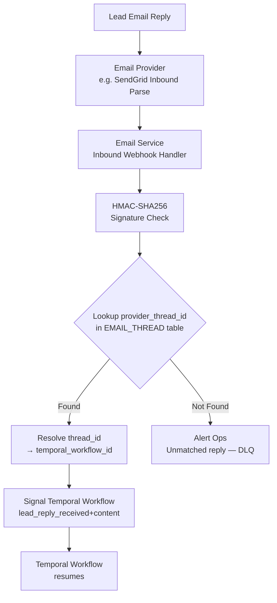

### Approval Portal

The **Approval Service** is a lightweight FastAPI app that:
1. Receives `send_approval_request` from Temporal (via activity)
2. Generates a signed JWT token (expires 48h)
3. Sends email to sales rep with an embedded HTML preview and Approve/Reject buttons
4. On HTTP callback: validates token, sends Temporal signal
5. Records decision in audit DB

---

## 12. Data Model

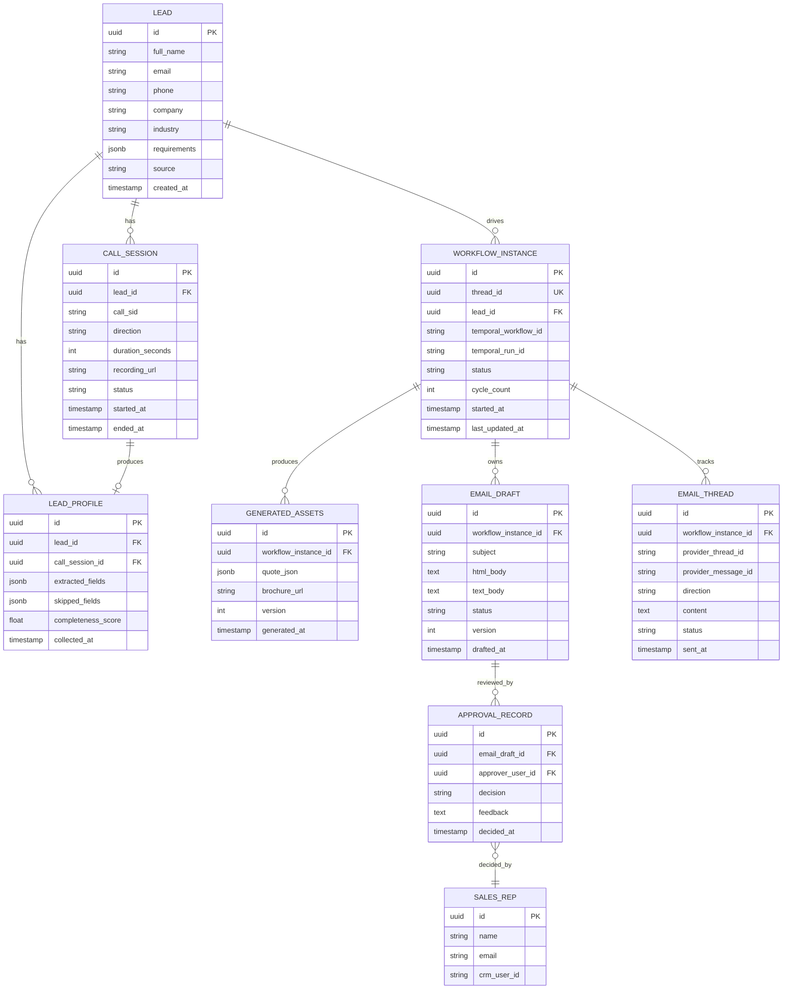

> **`thread_id` index**: `CREATE UNIQUE INDEX ON workflow_instance(thread_id);` — used as the cross-service correlation key in OTel baggage, email headers (`X-Thread-ID`), approval URLs, and CRM custom fields.

### `WORKFLOW_INSTANCE.status` Enum

Matches the state machine exactly:

```sql
CREATE TYPE workflow_status AS ENUM (
    'GENERATING_ASSETS', 'AWAITING_APPROVAL', 'REVISING_DRAFT',
    'EMAIL_SENT', 'AWAITING_REPLY', 'FOLLOW_UP_SENT',
    'NEGOTIATING', 'CLOSED_WON', 'CLOSED_LOST', 'COLD'
);
```

---

## 13. Technology Stack Recommendations

| Layer | Recommended | Alternatives | Rationale |
|---|---|---|---|
| **Durable Workflow** | Temporal.io (self-hosted or Cloud) | Conductor.io, AWS Step Functions | Best-in-class for long-lived, signal-driven workflows |
| **Voice Agent Framework** | LangGraph | LlamaIndex Workflows | Native state machine support; proven in production |
| **Telephony** | Twilio Media Streams | Vonage, Daily.co | Mature WebSocket streaming; wide LLM integration |
| **STT** | Deepgram Nova-3 | Gemini Live, Whisper | Lowest latency streaming STT |
| **LLM (realtime voice)** | Gemini 2.5 Flash (native audio) | GPT-4o Realtime | Integrated audio processing; cost-effective |
| **LLM (generation)** | GPT-4.1 / Claude Sonnet 3.7 | Gemini 1.5 Pro | Best long-form generation quality |
| **Email Platform** | SendGrid | AWS SES, Postmark | Native inbound parse webhook; deliverability |
| **PDF Generation** | WeasyPrint + HTML templates | Puppeteer, PDFKit | CSS-driven layouts; Python-native |
| **Event Bus** | Redis Streams | Kafka, RabbitMQ | Simple, low-ops; upgrade to Kafka at scale |
| **Database** | PostgreSQL (Supabase) | Cloud SQL | JSONB for flexible schema; RLS for multi-tenancy |
| **API Gateway** | FastAPI | Express.js | Async-native; Pydantic schema validation |
| **Observability** | OpenTelemetry + Grafana + Tempo | Datadog | Full traces across voice → workflow → email |

---

## 14. Non-Functional Requirements

### Performance
- **Voice latency**: end-to-end response < 700ms (STT → LLM → TTS)
- **Quote generation**: < 60 seconds (AI pipeline activity)
- **Email delivery**: < 5 seconds from approval confirmation

### Reliability
- **Workflow durability**: zero state loss across worker restarts, deploys, crashes
- **Activity retries**: exponential backoff, max 3 attempts for transient failures
- **Signal delivery**: at-least-once; activities must be idempotent
- **Approval timeout**: auto-escalate after 48h (configurable)

### Scalability
- Temporal workers scale horizontally per task queue
- Voice Gateway: stateless containers, scale by call concurrency
- Quote Engine: CPU-bound; scale via worker replicas

### Security
- Approval tokens: signed JWT (HS256), max 48h TTL
- Email webhooks: HMAC-SHA256 signature validation
- Temporal namespace: mTLS between workers and server
- PII data: encrypted at rest (AES-256), LeadProfile redacted in logs

### Observability
- Every Temporal workflow/activity is a trace span
- **`thread_id` propagated as OTel baggage** — appears on every span across Voice Gateway, Workflow, Quote Engine, Email Service, Approval Service
- Voice Agent: per-turn logging (transcript + extracted fields)
- Alert on: workflow stuck > 72h, activity failure rate > 5%, email bounce rate > 2%, unmatched reply webhooks > 0

---

## 15. Deployment Architecture

```mermaid
graph TB
    subgraph Internet["Internet / Edge"]
        CF[Cloudflare / AWS ALB]
    end

    subgraph AppPlane["Application Plane (Kubernetes / ECS)"]
        VGW[Voice Gateway\nPods × N]
        AS[Approval Service\nPods × 2]
        ES[Email Service\nPods × 2]
        TW[Temporal Workers\nPods × N]
    end

    subgraph DataPlane["Data Plane"]
        PG[(PostgreSQL)]
        Redis[(Redis Streams)]
        S3[(S3 / GCS)]
    end

    subgraph OrchPlane["Orchestration Plane"]
        TempSrv[Temporal Server\n(Temporal Cloud or self-hosted)]
    end

    subgraph InfraPlane["External Services"]
        Twilio[Twilio]
        LLM[LLM Providers]
        SG[SendGrid]
        CRM_EXT[CRM API]
    end

    CF --> VGW
    CF --> AS
    CF --> ES
    TW --> TempSrv
    VGW --> Redis
    Redis --> TW
    TW --> PG
    TW --> LLM
    TW --> SG
    TW --> CRM_EXT
    VGW --> Twilio
    TW --> S3
    AS --> TempSrv
    ES --> SG
    ES --> TempSrv
```

---

## Appendix: Design Alternatives Considered

### Alternative A: Pure Event-Driven (Kafka + State Machine in DB)
- **Pros**: Familiar, well-understood
- **Cons**: Must rebuild state tracking, timer management, and retry logic from scratch. Resuming a 2-week-old lead's "state" requires complex joins and state reconstruction. This is exactly what Temporal solves.

### Alternative B: AWS Step Functions
- **Pros**: Managed, no infra
- **Cons**: Cold start latency for Express executions; callback pattern is complex (task tokens); limited to 1-year lifetime for standard workflows; more expensive at volume; vendor lock-in.

### Alternative C: LangGraph Persisted Workflows
- **Pros**: Same framework as voice agent; Python-native
- **Cons**: Not designed for multi-week dormancy; no production-grade durable execution guarantees; lack of Temporal's operational features (visibility, namespaces, rate limiting).

### Selected: Temporal.io Entity Workflow
Best combination of durability, developer experience, operational visibility, and open-source foundation. No state reconstruction needed; workflows sleep for free.
