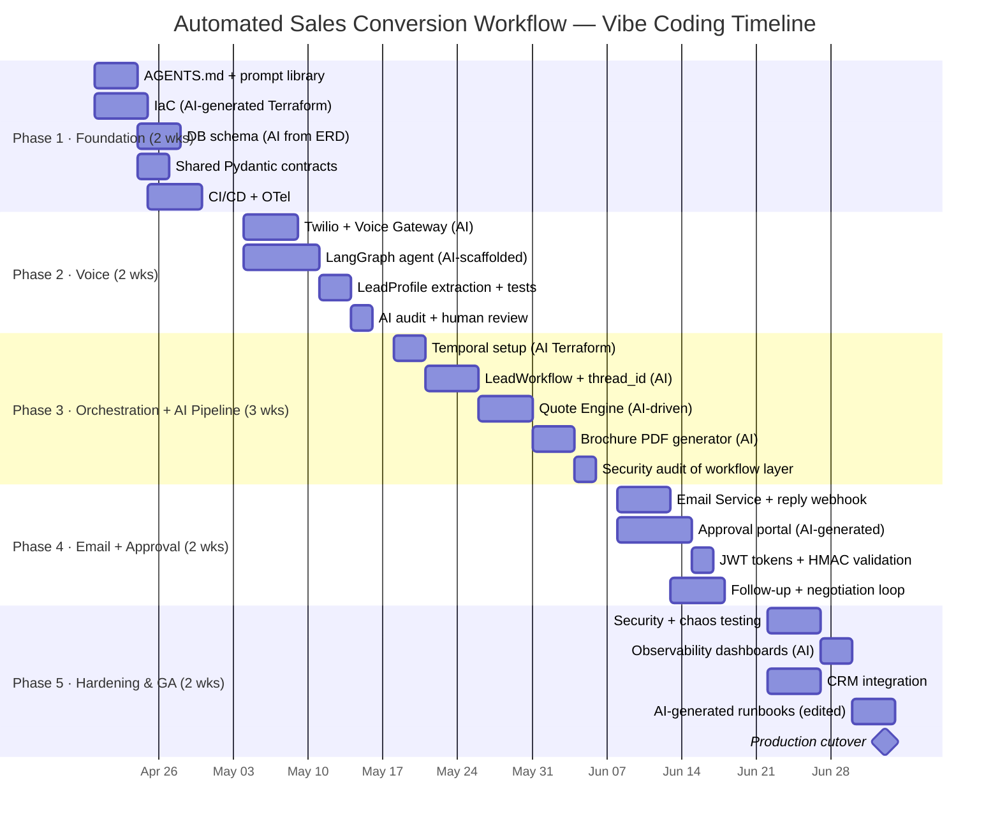

# Project Timeline — Automated Sales Conversion Workflow
### Vibe Coding Edition

> **Based on**: [architecture.md](file:///home/dynamo/.gemini/antigravity/brain/0dd93479-1572-4bd4-af4b-d0e056417741/architecture.md)
> **Start date**: 2026-04-20
> **Target GA**: 2026-07-03 *(12 weeks via AI-assisted development)*
> **Development approach**: Vibe Coding — AI coding agent (Antigravity / Claude Code) drives implementation; humans own architecture decisions, prompt engineering, code review, and security audits.

---

## What "Vibe Coding" Changes

| Concern | Traditional | Vibe Coding |
|---------|-------------|-------------|
| Boilerplate / scaffolding | 2–4 days/service | Hours |
| Schema & Pydantic models | Manual hand-authoring | Generated from architecture doc |
| Test generation | Separate TDD cycle | AI writes tests alongside code |
| DB migrations | Manual authoring | Generated from ERD description |
| Routine CRUD / glue code | Manual | Fully delegated to AI |
| Architecture decisions | AI-assisted | **Human-owned — non-negotiable** |
| Security & auth logic | Manual | AI-drafted, **human-audited** |
| Temporal workflow design | Manual | AI-scaffolded from state machine diagram |
| Total timeline | 16 weeks | **12 weeks** |

> [!IMPORTANT]
> Vibe coding accelerates implementation but **does not replace** design judgment, security review, or production hardening. Every AI-generated file must pass a human review gate before merge.

---

## Staffing — Vibe Coding Model

| Role | FTE | Notes |
|------|-----|-------|
| Lead Architect / Prompt Engineer | 1 | Owns all prompts, AGENTS.md, architecture decisions |
| Backend Engineer (review + integration) | 1 | Reviews AI output, owns merge decisions |
| AI/ML Engineer (voice + LLM prompts) | 1 | Drives AI pipeline prompts, evaluates output quality |
| DevOps / Platform Engineer | 0.5 | Infra-as-code (AI-assisted Terraform) |
| QA / Security Auditor | 0.5 | Vibe-code-specific audit at each phase gate |
| Technical Writer | 0.25 | Edits AI-generated docs |

*Compared to traditional: 6.25 FTE vs 6.5 FTE — but output velocity is ~2.5× higher.*

---

## Vibe Coding Workflow (applied every sprint)

```
1. Architect writes context prompt (AGENTS.md + task brief)
2. AI agent scaffolds code + tests
3. Human reviews diff — focus on: logic correctness, security, edge cases
4. AI-generated code audit (vibe-code-auditor) on each PR
5. Merge only after human sign-off
6. AI generates docs from implemented code
```

---

## Phase Overview



---

## Phase 1 — Foundation & AI Tooling Setup
**Weeks 1–2 · 2026-04-20 → 2026-05-01**

### Vibe Coding Priority: Set up the AI's "brain" first

| # | Deliverable | How AI Helps | Human Gate |
|---|-------------|-------------|------------|
| 1.1 | `AGENTS.md` — project instructions for AI agent | Architect writes; AI reviews gaps | Architect sign-off |
| 1.2 | Prompt library — one prompt template per service | Architect authors from architecture doc sections | Reviewed for precision |
| 1.3 | IaC (Terraform) for dev + staging | AI generates from `§15 Deployment` diagram | DevOps reviews resource config |
| 1.4 | PostgreSQL migrations (Alembic) | AI generates from `§12 Data Model` ERD | BE reviews FK constraints |
| 1.5 | Shared Pydantic schema library | AI generates from schema reference table | Lead Arch reviews field types |
| 1.6 | CI/CD pipeline + vibe-code-auditor step | AI generates GitHub Actions YAML | DevOps reviews secrets handling |
| 1.7 | OTel collector + Grafana Tempo | AI generates Helm values | DevOps validates trace ingestion |

> [!TIP]
> **Seed prompt**: Feed the entire [architecture.md](file:///home/dynamo/.gemini/antigravity/brain/0dd93479-1572-4bd4-af4b-d0e056417741/architecture.md) + `§12 Data Model` as context. Ask AI to generate all Alembic migrations in one pass. Expect ~85% accuracy; human reviews the FK and UNIQUE constraints carefully.

### Milestone Gate M1
> ✅ Dev env up, migrations pass, OTel traces live, `AGENTS.md` committed, CI pipeline runs vibe-code-auditor on every PR.

---

## Phase 2 — Voice Qualification Service
**Weeks 3–4 · 2026-05-04 → 2026-05-17**

*(Compressed from 3 → 2 weeks; AI handles Twilio WebSocket boilerplate and LangGraph scaffolding)*

| # | Deliverable | How AI Helps | Human Gate |
|---|-------------|-------------|------------|
| 2.1 | Twilio Media Streams WebSocket | AI scaffolds from Twilio docs | BE reviews error paths |
| 2.2 | Voice Gateway FastAPI service | AI generates from `§4 Container Diagram` | BE reviews concurrency model |
| 2.3 | LangGraph interview state machine | AI scaffolds from `§8` state diagram | AI/ML validates extraction logic |
| 2.4 | Deepgram STT + TTS integration | AI generates from Deepgram docs | AI/ML validates latency SLA |
| 2.5 | `LeadProfile` extractor + completeness score | AI generates + writes pytest suite | AI/ML reviews field coverage |
| 2.6 | `CALL_SESSION` DB write on call end | AI implements from schema | BE reviews transaction safety |
| 2.7 | `call_completed` Redis Streams publish | AI implements | BE reviews idempotency |
| 2.8 | **AI code audit** (vibe-code-auditor) | — | Security audits PII handling |

> [!IMPORTANT]
> PII (call recordings, `LeadProfile` fields) must be **human-reviewed** — AI has a pattern of logging sensitive fields. Check every `logger.*` call in the voice gateway.

### Milestone Gate M2
> ✅ Real call → valid `LeadProfile` in DB → `CALL_SESSION` persisted → event in Redis. Latency SLA < 700 ms. Audit clean.

---

## Phase 3 — Durable Orchestration + AI Asset Pipeline
**Weeks 5–7 · 2026-05-18 → 2026-06-05**

*(Compressed from 4 → 3 weeks)*

| # | Deliverable | How AI Helps | Human Gate |
|---|-------------|-------------|------------|
| 3.1 | Temporal server (Terraform) + mTLS | AI generates from `§15` | DevOps reviews cert rotation |
| 3.2 | `LeadWorkflow` Temporal workflow | AI scaffolds from `§7` state machine | Lead Arch reviews signal contracts |
| 3.3 | `thread_id` generation + OTel baggage propagation | AI generates from `§2.5` spec | BE validates all span attributes |
| 3.4 | Quote Engine activity (LLM prompt chain) | AI/ML authors prompts; AI generates Python wrapper | AI/ML evaluates output quality |
| 3.5 | Brochure PDF (WeasyPrint + S3) | AI generates HTML template + pipeline | BE reviews S3 upload auth |
| 3.6 | `WORKFLOW_INSTANCE` status transitions | AI implements from `workflow_status` enum | Lead Arch reviews all transitions |
| 3.7 | **Security audit** of workflow + quote engine | — | Auditor reviews JWT, mTLS, PII |

> [!WARNING]
> AI frequently generates Temporal activities **without proper idempotency keys**. Review every activity for `activity_id` usage before merge — signals must be at-least-once safe.

### Milestone Gate M3
> ✅ call → Temporal workflow → quote JSON → PDF in S3 → `AWAITING_APPROVAL` state. All spans linked by `thread_id`.

---

## Phase 4 — Email Loop, Approval Gate & Re-engagement
**Weeks 8–9 · 2026-06-08 → 2026-06-19**

*(Compressed from 4 → 2 weeks; AI handles portal UI and email boilerplate)*

| # | Deliverable | How AI Helps | Human Gate |
|---|-------------|-------------|------------|
| 4.1 | Email Service (SendGrid) + `X-Thread-ID` header | AI generates from `§11` | BE reviews header injection |
| 4.2 | SendGrid inbound parse webhook + HMAC | AI generates; writes HMAC test | Security audits signature check |
| 4.3 | `EMAIL_THREAD` reply lookup → Temporal signal | AI generates from `§11` flow | BE reviews race condition on lookup |
| 4.4 | Approval portal UI (React / HTML) | AI generates full portal from `§2.4` HITL spec | Frontend reviews UX + JWT flow |
| 4.5 | JWT approval tokens (HS256, 48h TTL) | AI generates + writes expiry tests | Security audits token claims |
| 4.6 | 48h approval timeout → escalation timer | AI implements Temporal timer | Lead Arch reviews timer cancel logic |
| 4.7 | Follow-up cadence + negotiation loop | AI scaffolds from `§7` state machine | AI/ML reviews LLM intent classifier |
| 4.8 | **AI code audit** (full email + approval stack) | — | Auditor focus: token forgery, replay |

### Milestone Gate M4
> ✅ Full happy path: call → approval → email sent → lead replies → `CLOSED_WON`. Approval audit trail complete.

---

## Phase 5 — Hardening & GA
**Weeks 10–12 · 2026-06-22 → 2026-07-03**

| # | Deliverable | How AI Helps | Human Gate |
|---|-------------|-------------|------------|
| 5.1 | Security review (JWT, HMAC, mTLS, PII) | AI scans with vibe-code-auditor | Security auditor resolves findings |
| 5.2 | Load test (500 concurrent calls, 10k workflows) | AI generates k6 scripts | QA validates SLOs |
| 5.3 | Chaos test (worker crash, DB failover) | AI scaffolds chaos scenarios | QA verifies zero state loss |
| 5.4 | Grafana dashboards + alerts | AI generates dashboard JSON | DevOps validates alert thresholds |
| 5.5 | CRM integration | AI generates from CRM API docs | BE reviews `thread_id` custom field sync |
| 5.6 | Runbooks | AI drafts from architecture doc | Tech writer edits + Lead Arch signs off |
| 5.7 | Production cutover | AI generates cutover checklist | Lead Arch + DevOps execute |

### Milestone Gate M5 (GA)
> ✅ All NFRs met, security findings closed, runbooks signed off, prod cutover zero-downtime.

---

## Summary Schedule

| Phase | Dates | Weeks | Key Output |
|-------|-------|-------|-----------|
| **1 · Foundation + AI Setup** | Apr 20 – May 01 | 2 | AGENTS.md, prompt library, infra, schema |
| **2 · Voice Qualification** | May 04 – May 17 | 2 | Voice agent end-to-end, `call_completed` event |
| **3 · Orchestration + AI Pipeline** | May 18 – Jun 05 | 3 | Temporal workflow, quote, PDF, `thread_id` |
| **4 · Email Loop + Approval** | Jun 08 – Jun 19 | 2 | Approval portal, reply routing, re-engagement |
| **5 · Hardening & GA** | Jun 22 – Jul 03 | 2 | Security, load test, CRM, runbooks, GA |

---

## Milestone Summary

| ID | Gate | Target | Criteria |
|----|------|--------|----------|
| M1 | Foundation + AI tooling | 2026-05-01 | AGENTS.md committed, env up, CI runs auditor |
| M2 | Voice agent live | 2026-05-17 | Real call → LeadProfile + CALL_SESSION; audit clean |
| M3 | Orchestration + pipeline | 2026-06-05 | call → PDF in S3 → AWAITING_APPROVAL |
| M4 | Full happy path | 2026-06-19 | call → approval → email → reply → CLOSED_WON |
| **M5** | **GA** | **2026-07-03** | All NFRs met, prod cutover done |

---

## Risk Register — Vibe Coding Edition

| # | Risk | Likelihood | Impact | Mitigation |
|---|------|------------|--------|-----------|
| R1 | AI hallucinates Temporal API (wrong method signatures) | High | High | Pin Temporal SDK version in context; always run tests before merge |
| R2 | AI generates code with PII in logs | High | Critical | vibe-code-auditor on every PR; grep for field names from `LeadProfile` |
| R3 | AI skips idempotency keys on Temporal activities | High | High | Checklist item in PR template: "All activities have `activity_id`?" |
| R4 | AI generates insecure JWT (no expiry, weak secret) | Medium | Critical | Security audit gate at Phase 3 + Phase 4; automated secret-scan in CI |
| R5 | AI produces over-complex code (abstraction creep) | Medium | Medium | `moyu` skill — guard against scope expansion; prefer simple over clever |
| R6 | LLM quote quality below acceptance | Medium | Medium | Human override flow; prompt iteration buffer in Phase 3 |
| R7 | Context window limit breaks mid-service coherence | Medium | Medium | Split large prompts by service; use AGENTS.md to maintain context |
| R8 | AI-generated Terraform creates over-privileged IAM | Medium | High | DevOps reviews all IAM policies; principle of least privilege enforced |
| R9 | Voice latency SLA (< 700 ms) not met | Medium | High | Benchmark in Week 3; fallback to Whisper |

---

## Vibe Coding Deliverables (additional to standard docs)

| Deliverable | Description | Phase |
|-------------|-------------|-------|
| `AGENTS.md` | AI agent instructions: project context, conventions, forbidden patterns, per-service task descriptions | 1 |
| `prompts/` directory | One prompt file per service — seed prompts used to generate each service's initial scaffold | 1–4 |
| `prompts/quote-engine.md` | Full prompt chain for quote generation with output schema | 3 |
| `prompts/interview-agent.md` | LangGraph state machine prompt + extraction schema | 2 |
| `docs/vibe-coding/audit-log.md` | Running log of AI-generated PRs, review notes, and findings by phase | 1–5 |
| `docs/vibe-coding/prompt-lessons.md` | What prompts worked, what failed, refinements made — institutional memory | 1–5 |
| `.github/PULL_REQUEST_TEMPLATE.md` | AI-aware PR checklist (idempotency, PII, security, test coverage) | 1 |

---

## AI-Aware PR Checklist (applied to every merge)

- [ ] Is any PII written to logs? (`phone`, `email`, `name`, `quote_json` details)
- [ ] Do all Temporal activities have an explicit `activity_id` for idempotency?
- [ ] Are JWT claims validated (expiry, audience, issuer)?
- [ ] Is HMAC validation present and tested on all incoming webhooks?
- [ ] Does the AI-generated code follow the shared Pydantic schema contract?
- [ ] Did `vibe-code-auditor` pass in CI?
- [ ] Did a human (not AI) review the security-sensitive paths?
