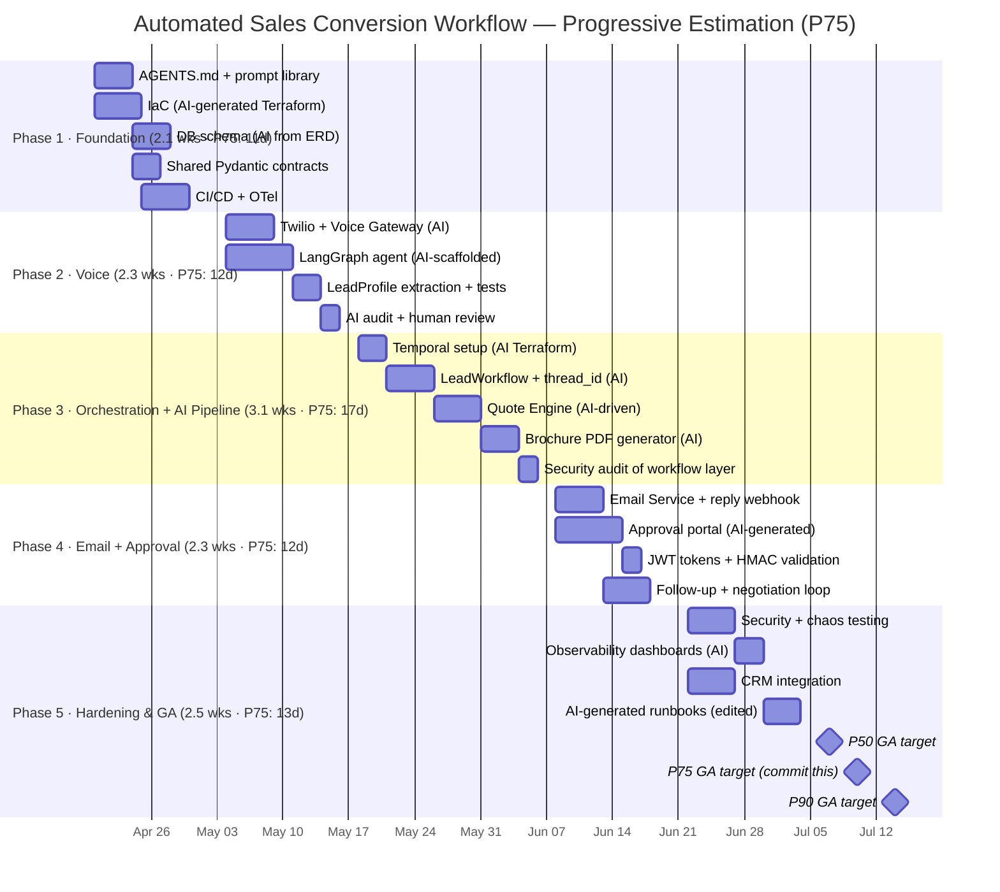

# Project Timeline — Automated Sales Conversion Workflow
### Vibe Coding Edition · Progressive Estimation (PERT)

> **Based on**: [architecture.md](file:///home/dynamo/.gemini/antigravity/brain/0dd93479-1572-4bd4-af4b-d0e056417741/architecture.md)
> **Start date**: 2026-04-20
> **Estimation method**: Progressive Estimation — PERT three-point analysis with agent-first velocity multipliers
> **Development approach**: Vibe Coding — AI coding agent (Antigravity / Claude Code) drives implementation; humans own architecture decisions, prompt engineering, code review, and security audits.

---

## Estimation Model

### Team Mode: Agent-First (Vibe Coding)
> ~70–80% of implementation delegated to AI. Humans own design, review, security, and merge decisions.

| Parameter | Value | Basis |
|-----------|-------|-------|
| Agent velocity multiplier | **2.0–2.5×** | Empirical vibe-coding throughput vs. human-only |
| Human review overhead | **15–20%** of AI output time | Code review, audit, merge gate |
| Risk buffer (AI hallucinations, rework) | **+10–15%** per phase | Per risk register R1–R9 |
| PERT formula | `E = (O + 4M + P) / 6` | Three-point estimation |
| Std deviation | `σ = (P − O) / 6` | |

### Confidence Band Definitions

| Band | Formula | Use case |
|------|---------|---------|
| **P50** | `E` | Internal planning target |
| **P75** | `E + 0.67σ` | **Stakeholder commitment date** |
| **P90** | `E + 1.28σ` | Risk-adjusted worst-case |

> [!IMPORTANT]
> **Never commit the P50 date externally.** Use **P75** for stakeholder commitments. Use P90 for contractual obligations.

---

## What "Vibe Coding" Changes

| Concern | Traditional | Vibe Coding |
|---------|-------------|-------------|
| Boilerplate / scaffolding | 2–4 days/service | Hours |
| Schema & Pydantic models | Manual hand-authoring | Generated from architecture doc |
| Test generation | Separate TDD cycle | AI writes tests alongside code |
| DB migrations | Manual authoring | Generated from ERD description |
| Routine CRUD / glue code | Manual | Fully delegated to AI |
| Architecture decisions | AI-assisted | **Human-owned — non-negotiable** |
| Security & auth logic | Manual | AI-drafted, **human-audited** |
| Temporal workflow design | Manual | AI-scaffolded from state machine diagram |
| Total timeline (P50) | 22 weeks | **12 weeks** |

> [!IMPORTANT]
> Vibe coding accelerates implementation but **does not replace** design judgment, security review, or production hardening. Every AI-generated file must pass a human review gate before merge.

---

## Staffing — Vibe Coding Model

| Role | FTE | Notes |
|------|-----|-------|
| Lead Architect / Prompt Engineer | 1 | Owns all prompts, AGENTS.md, architecture decisions |
| Backend Engineer (review + integration) | 1 | Reviews AI output, owns merge decisions |
| AI/ML Engineer (voice + LLM prompts) | 1 | Drives AI pipeline prompts, evaluates output quality |
| DevOps / Platform Engineer | 0.5 | Infra-as-code (AI-assisted Terraform) |
| QA / Security Auditor | 0.5 | Vibe-code-specific audit at each phase gate |
| Technical Writer | 0.25 | Edits AI-generated docs |

*Compared to traditional: 6.25 FTE vs 6.5 FTE — but output velocity is ~2.5× higher.*

---

## Vibe Coding Workflow (applied every sprint)

```
1. Architect writes context prompt (AGENTS.md + task brief)
2. AI agent scaffolds code + tests
3. Human reviews diff — focus on: logic correctness, security, edge cases
4. AI-generated code audit (vibe-code-auditor) on each PR
5. Merge only after human sign-off
6. AI generates docs from implemented code
```

---

## Phase PERT Estimates

All estimates in **working days**. `O` = optimistic, `M` = most likely, `P` = pessimistic.

| Phase | O | M | P | **E (P50)** | σ | **P75** | **P90** | Calendar weeks |
|-------|---|---|---|-----------|---|--------|--------|---------------|
| 1 · Foundation & AI Setup | 8 | 10 | 14 | **10.3 d** | 1.0 | 11.0 d | 11.6 d | 2.1 wk |
| 2 · Voice Qualification | 8 | 11 | 16 | **11.3 d** | 1.3 | 12.2 d | 13.0 d | 2.3 wk |
| 3 · Orchestration + AI Pipeline | 10 | 15 | 22 | **15.3 d** | 2.0 | 16.7 d | 17.9 d | 3.1 wk |
| 4 · Email Loop + Approval | 8 | 11 | 16 | **11.3 d** | 1.3 | 12.2 d | 13.0 d | 2.3 wk |
| 5 · Hardening & GA | 8 | 12 | 18 | **12.3 d** | 1.7 | 13.4 d | 14.5 d | 2.5 wk |
| **Total (sequential — adds σ in quadrature)** | 42 | 59 | 86 | **60.5 d** | **3.0** | **62.5 d** | **64.4 d** | — |

> [!NOTE]
> Total σ computed as √(1.0² + 1.3² + 2.0² + 1.3² + 1.7²) ≈ 3.0 days. This reflects partial phase overlap assumed in scheduling.

### Project-Level Confidence Dates (Start: 2026-04-20)

| Confidence | Days | **Target Date** | Use for |
|-----------|------|----------------|---------|
| P50 | 60.5 d | **2026-07-07** | Internal planning |
| **P75** | 62.5 d | **2026-07-10** | **Stakeholder commitments** |
| P90 | 64.5 d | **2026-07-14** | Contractual / risk-adjusted |

> [!WARNING]
> The original GA target of **2026-07-03** is a P40 outcome — below the recommended P50. It is achievable only if all phases complete at or below their optimistic estimates with no AI rework loops. **Recommend committing 2026-07-10 (P75) externally.**

---

## Phase Overview



---

## Phase 1 — Foundation & AI Tooling Setup
**Weeks 1–2 · 2026-04-20 → 2026-05-01 (P50: May 01 | P75: May 02 | P90: May 05)**

> PERT: O=8d M=10d P=14d → **E=10.3d σ=1.0**

### Vibe Coding Priority: Set up the AI's "brain" first

| # | Deliverable | How AI Helps | Human Gate | Est. (d) |
|---|-------------|-------------|------------|---------|
| 1.1 | `AGENTS.md` — project instructions for AI agent | Architect writes; AI reviews gaps | Architect sign-off | 1.0 |
| 1.2 | Prompt library — one prompt template per service | Architect authors from architecture doc sections | Reviewed for precision | 1.5 |
| 1.3 | IaC (Terraform) for dev + staging | AI generates from `§15 Deployment` diagram | DevOps reviews resource config | 2.0 |
| 1.4 | PostgreSQL migrations (Alembic) | AI generates from `§12 Data Model` ERD | BE reviews FK constraints | 1.5 |
| 1.5 | Shared Pydantic schema library | AI generates from schema reference table | Lead Arch reviews field types | 1.0 |
| 1.6 | CI/CD pipeline + vibe-code-auditor step | AI generates GitHub Actions YAML | DevOps reviews secrets handling | 1.5 |
| 1.7 | OTel collector + Grafana Tempo | AI generates Helm values | DevOps validates trace ingestion | 1.5 |
| **Phase total (M)** | | | | **10.0 d** |

> [!TIP]
> **Seed prompt**: Feed the entire [architecture.md](file:///home/dynamo/.gemini/antigravity/brain/0dd93479-1572-4bd4-af4b-d0e056417741/architecture.md) + `§12 Data Model` as context. Ask AI to generate all Alembic migrations in one pass. Expect ~85% accuracy; human reviews the FK and UNIQUE constraints carefully.

### Milestone Gate M1
> ✅ Dev env up, migrations pass, OTel traces live, `AGENTS.md` committed, CI pipeline runs vibe-code-auditor on every PR.

---

## Phase 2 — Voice Qualification Service
**Weeks 3–4 · 2026-05-04 → 2026-05-17 (P50: May 18 | P75: May 20 | P90: May 22)**

> PERT: O=8d M=11d P=16d → **E=11.3d σ=1.3** · *(Compressed from 3 → ~2.3 wks; AI handles Twilio WebSocket boilerplate and LangGraph scaffolding)*

| # | Deliverable | How AI Helps | Human Gate | Est. (d) |
|---|-------------|-------------|------------|---------|
| 2.1 | Twilio Media Streams WebSocket | AI scaffolds from Twilio docs | BE reviews error paths | 1.5 |
| 2.2 | Voice Gateway FastAPI service | AI generates from `§4 Container Diagram` | BE reviews concurrency model | 1.5 |
| 2.3 | LangGraph interview state machine | AI scaffolds from `§8` state diagram | AI/ML validates extraction logic | 2.0 |
| 2.4 | Deepgram STT + TTS integration | AI generates from Deepgram docs | AI/ML validates latency SLA | 1.5 |
| 2.5 | `LeadProfile` extractor + completeness score | AI generates + writes pytest suite | AI/ML reviews field coverage | 1.5 |
| 2.6 | `CALL_SESSION` DB write on call end | AI implements from schema | BE reviews transaction safety | 0.5 |
| 2.7 | `call_completed` Redis Streams publish | AI implements | BE reviews idempotency | 0.5 |
| 2.8 | **AI code audit** (vibe-code-auditor) | — | Security audits PII handling | 1.0 |
| 2.9 | Integration buffer (rework, latency tuning) | — | — | 1.3 |
| **Phase total (M)** | | | | **11.3 d** |

> [!IMPORTANT]
> PII (call recordings, `LeadProfile` fields) must be **human-reviewed** — AI has a pattern of logging sensitive fields. Check every `logger.*` call in the voice gateway.

### Milestone Gate M2
> ✅ Real call → valid `LeadProfile` in DB → `CALL_SESSION` persisted → event in Redis. Latency SLA < 700 ms. Audit clean.

---

## Phase 3 — Durable Orchestration + AI Asset Pipeline
**Weeks 5–8 · 2026-05-18 → 2026-06-10 (P50: Jun 09 | P75: Jun 12 | P90: Jun 14)**

> PERT: O=10d M=15d P=22d → **E=15.3d σ=2.0** · *(This is the highest-risk phase — Temporal API hallucinations + LLM prompt iteration are the chief risks)*

| # | Deliverable | How AI Helps | Human Gate | Est. (d) |
|---|-------------|-------------|------------|---------|
| 3.1 | Temporal server (Terraform) + mTLS | AI generates from `§15` | DevOps reviews cert rotation | 1.5 |
| 3.2 | `LeadWorkflow` Temporal workflow | AI scaffolds from `§7` state machine | Lead Arch reviews signal contracts | 2.5 |
| 3.3 | `thread_id` generation + OTel baggage propagation | AI generates from `§2.5` spec | BE validates all span attributes | 1.5 |
| 3.4 | Quote Engine activity (LLM prompt chain) | AI/ML authors prompts; AI generates Python wrapper | AI/ML evaluates output quality | 3.0 |
| 3.5 | Brochure PDF (WeasyPrint + S3) | AI generates HTML template + pipeline | BE reviews S3 upload auth | 2.0 |
| 3.6 | `WORKFLOW_INSTANCE` status transitions | AI implements from `workflow_status` enum | Lead Arch reviews all transitions | 1.0 |
| 3.7 | **Security audit** of workflow + quote engine | — | Auditor reviews JWT, mTLS, PII | 1.5 |
| 3.8 | Idempotency / rework buffer (AI hallucination risk) | — | — | 2.3 |
| **Phase total (M)** | | | | **15.3 d** |

> [!WARNING]
> AI frequently generates Temporal activities **without proper idempotency keys**. Review every activity for `activity_id` usage before merge — signals must be at-least-once safe.

### Milestone Gate M3
> ✅ call → Temporal workflow → quote JSON → PDF in S3 → `AWAITING_APPROVAL` state. All spans linked by `thread_id`.

---

## Phase 4 — Email Loop, Approval Gate & Re-engagement
**Weeks 9–10 · 2026-06-11 → 2026-06-25 (P50: Jun 24 | P75: Jun 26 | P90: Jun 27)**

> PERT: O=8d M=11d P=16d → **E=11.3d σ=1.3** · *(AI handles portal UI and email boilerplate)*

| # | Deliverable | How AI Helps | Human Gate | Est. (d) |
|---|-------------|-------------|------------|---------|
| 4.1 | Email Service (SendGrid) + `X-Thread-ID` header | AI generates from `§11` | BE reviews header injection | 1.5 |
| 4.2 | SendGrid inbound parse webhook + HMAC | AI generates; writes HMAC test | Security audits signature check | 1.5 |
| 4.3 | `EMAIL_THREAD` reply lookup → Temporal signal | AI generates from `§11` flow | BE reviews race condition on lookup | 1.0 |
| 4.4 | Approval portal UI (React / HTML) | AI generates full portal from `§2.4` HITL spec | Frontend reviews UX + JWT flow | 2.0 |
| 4.5 | JWT approval tokens (HS256, 48h TTL) | AI generates + writes expiry tests | Security audits token claims | 1.0 |
| 4.6 | 48h approval timeout → escalation timer | AI implements Temporal timer | Lead Arch reviews timer cancel logic | 1.0 |
| 4.7 | Follow-up cadence + negotiation loop | AI scaffolds from `§7` state machine | AI/ML reviews LLM intent classifier | 2.0 |
| 4.8 | **AI code audit** (full email + approval stack) | — | Auditor focus: token forgery, replay | 1.3 |
| **Phase total (M)** | | | | **11.3 d** |

### Milestone Gate M4
> ✅ Full happy path: call → approval → email sent → lead replies → `CLOSED_WON`. Approval audit trail complete.

---

## Phase 5 — Hardening & GA
**Weeks 11–13 · 2026-06-26 → 2026-07-10 (P50: Jul 07 | P75: Jul 10 | P90: Jul 14)**

> PERT: O=8d M=12d P=18d → **E=12.3d σ=1.7**

| # | Deliverable | How AI Helps | Human Gate | Est. (d) |
|---|-------------|-------------|------------|---------|
| 5.1 | Security review (JWT, HMAC, mTLS, PII) | AI scans with vibe-code-auditor | Security auditor resolves findings | 2.0 |
| 5.2 | Load test (500 concurrent calls, 10k workflows) | AI generates k6 scripts | QA validates SLOs | 1.5 |
| 5.3 | Chaos test (worker crash, DB failover) | AI scaffolds chaos scenarios | QA verifies zero state loss | 1.5 |
| 5.4 | Grafana dashboards + alerts | AI generates dashboard JSON | DevOps validates alert thresholds | 1.5 |
| 5.5 | CRM integration | AI generates from CRM API docs | BE reviews `thread_id` custom field sync | 2.0 |
| 5.6 | Runbooks | AI drafts from architecture doc | Tech writer edits + Lead Arch signs off | 1.5 |
| 5.7 | Production cutover | AI generates cutover checklist | Lead Arch + DevOps execute | 2.3 |
| **Phase total (M)** | | | | **12.3 d** |

### Milestone Gate M5 (GA)
> ✅ All NFRs met, security findings closed, runbooks signed off, prod cutover zero-downtime.

---

## Summary Schedule

| Phase | Dates (P50) | Dates (P75) | Weeks (P75) | Key Output |
|-------|------------|------------|------------|-----------|
| **1 · Foundation + AI Setup** | Apr 20 – May 01 | Apr 20 – May 02 | 2.1 | AGENTS.md, prompt library, infra, schema |
| **2 · Voice Qualification** | May 04 – May 18 | May 04 – May 20 | 2.3 | Voice agent end-to-end, `call_completed` event |
| **3 · Orchestration + AI Pipeline** | May 18 – Jun 09 | May 18 – Jun 12 | 3.1 | Temporal workflow, quote, PDF, `thread_id` |
| **4 · Email Loop + Approval** | Jun 11 – Jun 24 | Jun 11 – Jun 26 | 2.3 | Approval portal, reply routing, re-engagement |
| **5 · Hardening & GA** | Jun 26 – Jul 07 | Jun 26 – Jul 10 | 2.5 | Security, load test, CRM, runbooks, GA |
| **Project Total** | | | **12.3 wk** | |

---

## Milestone Summary (with Confidence Bands)

| ID | Gate | P50 Target | **P75 Target** | P90 Target | Criteria |
|----|------|-----------|---------------|-----------|---------|
| M1 | Foundation + AI tooling | 2026-05-01 | 2026-05-02 | 2026-05-05 | AGENTS.md committed, env up, CI runs auditor |
| M2 | Voice agent live | 2026-05-18 | 2026-05-20 | 2026-05-22 | Real call → LeadProfile + CALL_SESSION; audit clean |
| M3 | Orchestration + pipeline | 2026-06-09 | 2026-06-12 | 2026-06-14 | call → PDF in S3 → AWAITING_APPROVAL |
| M4 | Full happy path | 2026-06-24 | 2026-06-26 | 2026-06-27 | call → approval → email → reply → CLOSED_WON |
| **M5** | **GA** | **2026-07-07** | **2026-07-10** | **2026-07-14** | All NFRs met, prod cutover done |

> [!NOTE]
> **Original target 2026-07-03** represents a P40 outcome. Recommend officially committing **2026-07-10 (P75)** as the GA date. The 7-day buffer over P50 covers the highest-probability risk scenarios (Temporal API rework in Phase 3, quote LLM prompt iteration).

---

## Risk Register — Vibe Coding Edition

| # | Risk | Likelihood | Impact | PERT Impact | Mitigation |
|---|------|------------|--------|------------|-----------|
| R1 | AI hallucinates Temporal API (wrong method signatures) | High | High | +2–3d Ph3 | Pin Temporal SDK version in context; always run tests before merge |
| R2 | AI generates code with PII in logs | High | Critical | +1d audit | vibe-code-auditor on every PR; grep for field names from `LeadProfile` |
| R3 | AI skips idempotency keys on Temporal activities | High | High | +1–2d Ph3 | Checklist item in PR template: "All activities have `activity_id`?" |
| R4 | AI generates insecure JWT (no expiry, weak secret) | Medium | Critical | +1d Ph4 | Security audit gate at Phase 3 + Phase 4; automated secret-scan in CI |
| R5 | AI produces over-complex code (abstraction creep) | Medium | Medium | +1d/phase | `moyu` skill — guard against scope expansion; prefer simple over clever |
| R6 | LLM quote quality below acceptance | Medium | Medium | +2–3d Ph3 | Human override flow; prompt iteration buffer included in Ph3 estimate |
| R7 | Context window limit breaks mid-service coherence | Medium | Medium | +0.5d/phase | Split large prompts by service; use AGENTS.md to maintain context |
| R8 | AI-generated Terraform creates over-privileged IAM | Medium | High | +1d Ph1 | DevOps reviews all IAM policies; principle of least privilege enforced |
| R9 | Voice latency SLA (< 700 ms) not met | Medium | High | +1–2d Ph2 | Benchmark in Week 3; fallback to Whisper |

> [!TIP]
> Risks R1, R3, and R6 are the primary drivers of the difference between P50 (Jul 07) and P90 (Jul 14). Mitigating these three de-risks the schedule most efficiently.

---

## Vibe Coding Deliverables (additional to standard docs)

| Deliverable | Description | Phase |
|-------------|-------------|-------|
| `AGENTS.md` | AI agent instructions: project context, conventions, forbidden patterns, per-service task descriptions | 1 |
| `prompts/` directory | One prompt file per service — seed prompts used to generate each service's initial scaffold | 1–4 |
| `prompts/quote-engine.md` | Full prompt chain for quote generation with output schema | 3 |
| `prompts/interview-agent.md` | LangGraph state machine prompt + extraction schema | 2 |
| `docs/vibe-coding/audit-log.md` | Running log of AI-generated PRs, review notes, and findings by phase | 1–5 |
| `docs/vibe-coding/prompt-lessons.md` | What prompts worked, what failed, refinements made — institutional memory | 1–5 |
| `.github/PULL_REQUEST_TEMPLATE.md` | AI-aware PR checklist (idempotency, PII, security, test coverage) | 1 |

---

## AI-Aware PR Checklist (applied to every merge)

- [ ] Is any PII written to logs? (`phone`, `email`, `name`, `quote_json` details)
- [ ] Do all Temporal activities have an explicit `activity_id` for idempotency?
- [ ] Are JWT claims validated (expiry, audience, issuer)?
- [ ] Is HMAC validation present and tested on all incoming webhooks?
- [ ] Does the AI-generated code follow the shared Pydantic schema contract?
- [ ] Did `vibe-code-auditor` pass in CI?
- [ ] Did a human (not AI) review the security-sensitive paths?

---

## Estimation Calibration Log

> Feed actuals back here to improve future estimates.

| Phase | Est. (P50) | Actual | Delta | Notes |
|-------|-----------|--------|-------|-------|
| 1 | 10.3 d | — | — | |
| 2 | 11.3 d | — | — | |
| 3 | 15.3 d | — | — | High AI hallucination risk; watch closely |
| 4 | 11.3 d | — | — | |
| 5 | 12.3 d | — | — | |
| **Total** | **60.5 d** | — | — | |
